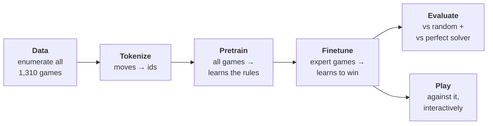

# llm-ecosphere

> A closed world, small enough to explain an LLM ecosystem completely.

[](https://github.com/yves-vogl/llm-ecosphere/actions/workflows/ci.yml)
[](https://yves-vogl.github.io/llm-ecosphere/)
[](https://github.com/yves-vogl/llm-ecosphere/actions/workflows/ci.yml)
[](https://securityscorecards.dev/viewer/?uri=github.com/yves-vogl/llm-ecosphere)
[](LICENSE)
[](https://www.python.org/)
[](https://pytorch.org/)
[](https://github.com/sponsors/yves-vogl)

Build, train, run and *understand* a language model from scratch, in Python.

The model is a real GPT — the same decoder-only Transformer architecture as
GPT-2/3, Llama or Claude, shrunk to ~0.8M parameters — and its entire world
is **Drop-Tac-Toe**: Tic-Tac-Toe on a 3x3 board with Connect-Four gravity.
It learns the game purely from text transcripts of moves, the way a real LLM
learns language purely from text. Because the game is exactly solvable, every
question about the model has a ground-truth answer: we can *measure* what it
learned instead of guessing.

## The game

Columns are `A B C` (x-axis), rows `1 2 3` (y-axis, bottom to top). A move
drops a piece into a column; it lands on the lowest free cell and is written
as that cell: `A1` is bottom-left, `C3` top-right. Pieces never float — `C3`
is only legal once `C1` and `C2` are occupied. `X` moves first; three in a
row (horizontal, vertical, diagonal) wins.

The included solver proves: **with perfect play the game is a draw**. There
are exactly **1,310 possible complete games** across **694 reachable
positions** — a closed world, small enough to enumerate completely.

## The idea: the whole LLM pipeline, scaled down



| This repo                                       | Real LLM pipeline                  |
| ----------------------------------------------- | ---------------------------------- |
| Enumerate all 1,310 games                       | Scrape a web-scale text corpus     |
| 15-token move-level vocabulary                  | BPE tokenizer, ~100k tokens        |
| Pretrain on *all* games → learns the rules      | Pretraining → learns grammar/facts |
| Finetune on solver-optimal games, opponent moves masked from the loss | SFT — imitate the assistant, mask the user turns |
| Temperature / top-k sampling, legality masking  | Decoding strategies, guardrails    |
| Legality, refereeing, win-rate metrics          | Evals and benchmarks               |
| `inspect_attention.py`                          | Interpretability research          |

## Quickstart

Requires [uv](https://docs.astral.sh/uv/) (or any Python 3.12 — see below).
Everything runs on plain CPU.

```bash
make setup      # create .venv and install torch + pytest
make test       # 56 unit tests
make data       # enumerate every game        (seconds)
make pretrain   # learn the rules             (~2 min CPU)
make finetune   # learn to play well          (~1 min CPU)
make eval       # measure what it learned     (seconds)
make play       # play against it!
```

Without uv:

```bash
python3.12 -m venv .venv
.venv/bin/pip install -r requirements.txt
```

## Results

Measured with `python -m minillm.evaluate` (see `runs/eval_pretrain.json`
and `runs/eval.json`; your numbers will match closely — training is seeded):

| Metric                                   | after pretraining | after finetuning |
| ---------------------------------------- | ----------------: | ---------------: |
| Top-choice is a legal move (held-out)    |            100.0% |            99.5% |
| Free-running legality (first try)        |             99.8% |            98.8% |
| Predicts the correct result token        |             99.2% |           100.0% |
| vs random player, win / draw / loss      |  41.8 / 20.2 / 38.0% | 79.2 / 14.5 / 6.2% |
| vs perfect solver, win / draw / loss     |     0 / 0 / 100%  |  0 / 61.0 / 39.0% |
| Chooses a solver-optimal move            |             70.3% |            86.5% |

The story these numbers tell is the story of modern LLMs: **pretraining
teaches form** (the model plays 100% legally but only imitates the *average*
game — near coin-flip vs a random opponent), **finetuning teaches intent**
(79% wins vs random; 61% draws against the perfect solver, and a draw is the
theoretical ceiling). Even the tiny legality dip after finetuning mirrors the
real-world "alignment tax".

## Playing

```bash
make play                              # you are X, model is finetuned
.venv/bin/python -m minillm.play --human O          # model opens
.venv/bin/python -m minillm.play --raw --show-probs # watch it think, mistakes allowed
.venv/bin/python -m minillm.play --ckpt runs/pretrain/model.pt  # play the rule-learner
```

In-game: `A`/`B`/`C` drops a piece, `p` shows the model's probability
distribution, `u` undoes, `q` quits. The model never sees the board — only
the move sequence, exactly as during training.

## Looking inside

```bash
make sample      # model dreams up full games; each is replayed and verified
make attention   # attention matrices per layer/head for a game prefix
```

## Repo map

The Python package keeps the short import name `minillm`.

```
minillm/
  game.py        the rules ("physics" of the toy world)  — no ML
  solver.py      exact negamax solver: ground truth + data generator
  tokenizer.py   move-level (15 tokens) + char-level (13 tokens) vocabularies
  dataset.py     corpus enumeration, splits, tensors, SFT loss masking
  config.py      ModelConfig dataclass
  model.py       the GPT, from scratch, heavily commented
  train.py       pretrain + finetune loops (AdamW, warmup+cosine, ...)
  sample.py      free-running generation + transcript verification
  evaluate.py    behavioural metrics
  play.py        interactive play
  inspect_attention.py  print attention heads
  utils.py       device, seeding, checkpoint loading
tests/           56 tests: rules, solver, tokenizers, masking, causality
docs/            the guided tour (start at docs/00-overview.md)
data/, runs/     generated artifacts (gitignored, reproducible)
.github/         CI, SAST, secret scan, commit lint, Pages deploy, Dependabot
requirements/    hash-pinned lockfiles for the CI toolchain
mkdocs.yml       documentation site config (published to GitHub Pages)
```

## Documentation

**→ Rendered site: <https://yves-vogl.github.io/llm-ecosphere/>**

Read in order — each chapter explains one pipeline stage against this
codebase, with "In a real LLM" asides connecting it to production scale:

1. [Overview](docs/00-overview.md)
2. [The game and its exact solver](docs/01-the-game.md)
3. [From games to a training corpus](docs/02-data.md)
4. [Tokenization](docs/03-tokenization.md)
5. [The Transformer, spelled out](docs/04-model.md)
6. [Training: pretraining and finetuning](docs/05-training.md)
7. [Inference: sampling and playing](docs/06-inference.md)
8. [Evaluation: what did it learn?](docs/07-evaluation.md)
9. [Exercises: make it yours](docs/08-exercises.md)
10. [Lab report: the character-level tokenizer](docs/09-char-tokenizer-lab.md) — exercise 1, solved and measured (spoilers!)
11. [Why GPUs? The hardware under the pipeline](docs/10-gpu-cuda.md)

For teaching: [learning paths + a 3-hour workshop script](docs/learning-paths.md),
and a [glossary](docs/glossary.md) that grounds every LLM term in this repo's code.

## Contributing

Contributions welcome — see [CONTRIBUTING.md](CONTRIBUTING.md). PRs go
against `main`, commits follow Conventional Commits and are GPG-signed.
Security findings go through [SECURITY.md](SECURITY.md), not public issues.

## License

[MIT](LICENSE) — Copyright (c) 2026 Yves Vogl.
