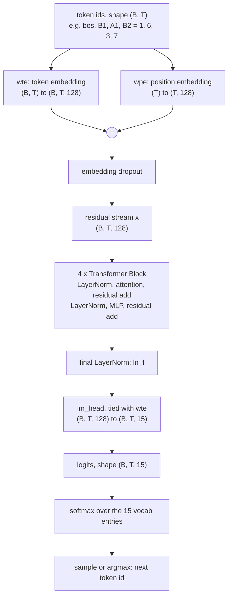
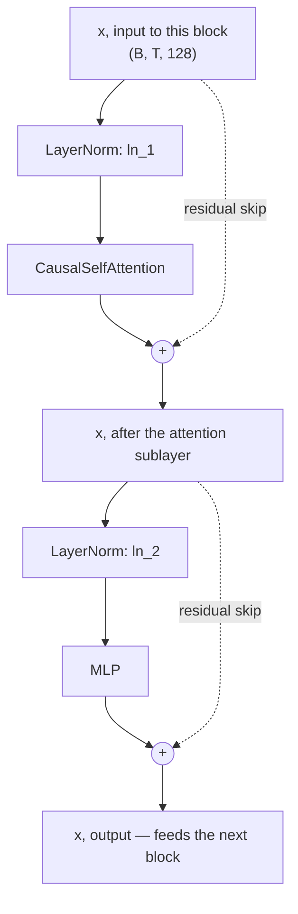
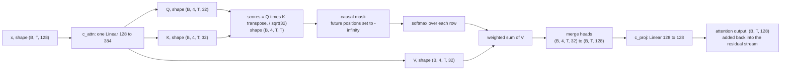

# Anatomy of a tiny GPT — every part, where it lives, what it does, how to change it

[04 — The Transformer, spelled out](04-model.md) derives this model's math at
reading speed, with the initialization tricks and the proofs that back up
every claim. This page has a narrower job: assume no ML background at all,
and for every moving part of the model answer four questions, in order —

1. **What it is** — plain language, with the smallest possible example.
2. **Where it lives** — the exact class, method or line in
   [`minillm/model.py`](https://github.com/yves-vogl/llm-ecosphere/blob/main/minillm/model.py),
   plus the matching knob in `minillm/config.py` if there is one.
3. **What it does** — one tiny concrete example, walked through with real
   tensor shapes.
4. **How to change it** — a config flag or a one-line code edit, and what
   you should expect to observe.

Read this next to `minillm/model.py` open in an editor. Every number below
— parameter counts, tensor shapes, which line does what — was read
directly out of that file and `minillm/config.py`, not recalled from memory
of how GPT-2 usually works. Where this project omits something real
frontier models have, that is called out explicitly in a boxed note.

## One example, followed all the way through

Every section below reuses the same tiny example: the game opens
`B1 A1 B2` — X drops into column B (landing on `B1`, the bottom of an empty
column), O drops into column A (landing on `A1`), X drops into column B
again (landing on `B2`, since `B1` is now occupied beneath it). Under the
tokenizer's fixed 15-token vocabulary
([03 — Tokenization](03-tokenization.md)), the prompt the model actually
sees is `<bos> B1 A1 B2`, which encodes to the integer ids

```
[1, 6, 3, 7]
```

that is, `<bos>` = 1, `B1` = 6, `A1` = 3, `B2` = 7. This is the exact prompt
`docs/04-model.md` uses when it prints real attention matrices with
`minillm/inspect_attention.py` — the numbers you'd see running that
command are the continuation of the walkthrough on this page.

## The whole forward pass, at a glance

Before zooming into each part, here is the entire journey from token ids to
a sampled next move, matching `GPT.forward` and `GPT.generate` in
`minillm/model.py` top to bottom:



Every box gets its own section below, in the same top-to-bottom order.

## Token ids to token embedding

### What it is

A token id is just an integer — `B2` is the number 7, per the vocabulary
table in `minillm/tokenizer.py`. Integers carry no notion of "similar to":
id 7 is not closer to id 6 than to id 0 in any way a network can use. The
token embedding is a **lookup table**: one row of numbers per vocabulary
entry, and looking up token 7 hands back that row as a vector — a
dictionary translating each of the 15 possible words of this language into
a point in a 128-dimensional space, one the model is free to move during
training.

### Where it lives

`self.transformer.wte` in `GPT.__init__`
([`minillm/model.py`](https://github.com/yves-vogl/llm-ecosphere/blob/main/minillm/model.py)):

```python
wte=nn.Embedding(config.vocab_size, config.n_embd),  # token embeddings
```

`vocab_size` (15) and `n_embd` (128) both come from `ModelConfig` in
`minillm/config.py`. `wte` is a 15-row, 128-column matrix — 1,920 numbers,
all learned.

### What it does

`GPT.forward` calls `self.transformer.wte(idx)`. For the running example
`idx = [1, 6, 3, 7]` (shape `(B=1, T=4)`), this looks up rows 1, 6, 3 and 7
and stacks them, producing `tok_emb` of shape `(1, 4, 128)` — one
128-number vector per input token. At the start of training these vectors
are random (`Normal(0, 0.02)`, see `_init_weights`); by the end, the nine
move-token rows (`A1`..`C3`) have organized themselves into a geometry
gradient descent found useful for predicting legal continuations.

### How to change it

`n_embd` in `minillm/config.py` controls the width of every embedding —
and, as later sections show, of attention and the MLP too, since it is the
width of the whole residual stream:

```bash
.venv/bin/python -m minillm.train --stage pretrain --n-embd 16 --out-dir runs/exp-narrow
.venv/bin/python -m minillm.evaluate --ckpt runs/exp-narrow/model.pt
```

Expect legality and win-rate metrics to degrade relative to the README's
numbers — 16 dimensions is a tight bottleneck for "which of 9 cells, in
what order." Widen it (`--n-embd 256`) and expect little further gain,
since attention and MLP matrix sizes grow quadratically with `n_embd`
while the README's numbers already sit close to this game's ceiling.

## Positional embedding — how the model knows move order

### What it is

Attention (the next major component) looks at a *set* of earlier tokens
and has no built-in sense of which came first — it is
permutation-invariant by construction. In this game, order is everything:
whether `B2` is even legal depends on `B1` having already been played. The
positional embedding fixes this by giving each *position* in the sequence
— "1st token," "2nd token," and so on — its own learned vector, added on
top of the token's own vector.

### Where it lives

`self.transformer.wpe`, right next to `wte`:

```python
wpe=nn.Embedding(config.block_size, config.n_embd),  # position embeddings
```

Note the shape: `block_size` (16) rows, not `vocab_size` — one row per
possible *position* in the sequence, up to the model's context length.

### What it does

```python
pos = torch.arange(T)                          # [0, 1, 2, 3] for T=4
pos_emb = self.transformer.wpe(pos)             # (T, C) = (4, 128)
x = self.transformer.drop(tok_emb + pos_emb)    # (B, T, C) = (1, 4, 128)
```

For the running example (`T=4`), `pos_emb` looks up rows 0, 1, 2, 3 of
`wpe`. These are simply **added** to the token embeddings, not
concatenated — the model is free to use different subspaces of the 128
dimensions for "what token" and "which position." The sum, after dropout,
becomes `x`: the model's very first residual-stream tensor.

### How to change it

`block_size` sets how many rows `wpe` has — the longest sequence the model
can ever see. It cannot go below what the tokenizer needs; `train.py`
checks this explicitly:

```bash
.venv/bin/python -m minillm.train --stage pretrain --block-size 10
```

fails immediately with `block_size 10 cannot hold the longest game: the
'move' tokenizer needs up to 12 tokens — pass --block-size 11 or larger`
(`minillm/train.py`) — a concrete guard rail, not a silent truncation. For
a more dramatic edit, delete `pos_emb` from the `tok_emb + pos_emb` line in
`minillm/model.py`: the model becomes blind to order (Exercise 3 in
[08 — Exercises](08-exercises.md)). Predict, before you train, which facts
survive — *which* cells are occupied is order-independent — and which
collapse — *who owns* each cell is not.

## The residual stream — the central highway

This is the single idea worth understanding above all others here, so it
earns its own section before attention.

### What it is

After the embeddings, the tensor `x` — shape `(B, T, 128)` — is the
**residual stream**. Picture a highway with 128 parallel lanes running the
length of the sequence. Every component from here on — every attention
sublayer, every MLP — is a small factory built *beside* the highway: it
reads the traffic on the lanes, computes something, and merges its output
back in by **addition**, never by overwriting. Nothing downstream of the
embeddings ever replaces `x`; everything only adds to it.

### Where it lives

The pattern `x = x + sublayer(x)`, written twice in `Block.forward`:

```python
def forward(self, x, record_attn=False):
    x = x + self.attn(self.ln_1(x), record_attn=record_attn)
    x = x + self.mlp(self.ln_2(x))
    return x
```

The same `x` is threaded through all `n_layer` blocks in `GPT.forward`'s
loop, then handed to the final LayerNorm.

### What it does

For the running example, `x` starts as `(1, 4, 128)` and comes out of each
block still `(1, 4, 128)`, numerically changed but never reshaped. The
attention sublayer might write into `x` "position `B2` has a same-column
predecessor at position `B1`" (the attention section below shows the
literal, measured version of this). The MLP that follows can then read
that fact off the stream. By the time `x` reaches the final LayerNorm it
has accumulated eight additions (two per block, four blocks) — but the raw
embedding signal from step one is still recoverable in there, because
nothing was ever erased.

This is also why both `LayerNorm`s inside a block apply to the *input* of
each sublayer rather than to the sum afterward — **pre-norm**. `x` itself
stays raw and unnormalized end to end, so gradients flowing backward
during training travel the whole highway without passing through a single
weight matrix — what makes a stack of blocks trainable at all.

### How to change it

Not a config knob — it is the model's shape — so the way to "change" it
is to break it and watch. In `Block.forward`, replace `x = x +
self.attn(self.ln_1(x), record_attn=record_attn)` with `x =
self.attn(self.ln_1(x), record_attn=record_attn)` (dropping the `x +`, so
the sublayer's output *replaces* the stream instead of adding to it),
retrain with `make pretrain`, and compare `make eval` against the
README's baseline. Expect training to struggle noticeably more — you cut
the direct gradient path just described, and pre-norm's whole
justification is that path's existence. Put the `x +` back afterward.

## Inside a Transformer block

`n_layer` (4) copies of this block are stacked. Each has exactly two
sublayers — attention, then MLP — each wrapped in its own
pre-norm-and-residual-add:



The dotted lines are the residual skips from the previous section, drawn
explicitly: `xin` reaches `add1` two ways — transformed by attention, and
completely unchanged.

### LayerNorm

**What it is.** `LayerNorm` rescales the 128 numbers at each position to
zero mean and unit variance, then applies a learned per-channel gain and
bias. It is bookkeeping, not "thinking" — its job is keeping numbers in a
well-behaved range so training stays numerically stable.

**Where it lives.** `self.ln_1` and `self.ln_2` in `Block.__init__`, both
plain `nn.LayerNorm(config.n_embd)` — two *separate* instances with their
own learned gain and bias.

**What it does.** Applied to `x` of shape `(1, 4, 128)`, `ln_1(x)` returns
the identical shape — LayerNorm never changes shape, only rescales each
position's 128 numbers independently of every other position.

**How to change it.** No config flag touches LayerNorm directly (only
`n_embd`, already covered above), so the edit here is architectural: move
`ln_1`/`ln_2` to *after* each sublayer instead of before —
`x = self.ln_1(x + self.attn(x))` instead of `x = x + self.attn(self.ln_1(x))`
— reproducing the original 2017 Transformer's "post-norm" layout that
GPT-2 moved away from. Expect training to become more sensitive to
learning rate and depth; this project's small `n_layer=4` stack may still
train, but pre-norm stops being optional as stacks get deep.

### Self-attention, broken all the way down

**What it is.** Attention is the only place in the model where information
moves *between* positions — everywhere else, each position is processed
on its own. Each token emits three vectors: a **query** ("what am I
looking for?"), a **key** ("what do I contain?"), and a **value** ("what
do I hand over if attended to?"). A token's new representation is a
weighted average of earlier tokens' values, weighted by how well its query
matches each earlier token's key.

**Where it lives.** The `CausalSelfAttention` class in
[`minillm/model.py`](https://github.com/yves-vogl/llm-ecosphere/blob/main/minillm/model.py).
`n_head` in `minillm/config.py` (4) sets how many independent attention
patterns run in parallel; head size `hs = n_embd / n_head = 128 / 4 = 32`.



**What it does**, for `x` of shape `(B=1, T=4, C=128)` from `<bos> B1 A1 B2`:

- **Q/K/V projections.** One fused `nn.Linear(128, 384)` — `self.c_attn`
  — produces queries, keys and values in one matmul; `q, k, v =
  self.c_attn(x).split(C, dim=2)` splits the 384 output channels back
  into three `(1, 4, 128)` tensors. Fusing three `128→128` projections
  into one `128→384` changes nothing mathematically; it is a
  kernel-launch efficiency trick from GPT-2's original code, hence the
  name `c_attn`.
- **Splitting into heads.** `q.view(B, T, nh, hs).transpose(1, 2)`
  reshapes `(1, 4, 128)` into `(1, 4, 4, 32)` — nothing is computed, the
  128 channels are simply reinterpreted as 4 groups of 32. Each head runs
  its own attention pattern in its own 32-dimensional slice.
- **Scores and scaling.** `att = (q @ k.transpose(-2, -1)) / math.sqrt(hs)`
  computes every query's dot product against every key, per head:
  `(1,4,4,32) @ (1,4,32,4) → (1,4,4,4)`, a 4x4 compatibility matrix per
  head. Dividing by `sqrt(32) ≈ 5.66` stops those dot products from
  growing so large that softmax saturates into a near one-hot
  distribution with vanishing gradients.
- **The causal mask.** A token must never see the future — during
  generation, later tokens don't exist yet, so training cannot cheat by
  peeking. `self.causal_mask`, a constant lower-triangular matrix built
  once with `torch.tril` and stored via `register_buffer` (saved with
  checkpoints, never trained), marks which `(query, key)` pairs are
  allowed. `masked_fill(... == 0, float("-inf"))` sets every forbidden
  score to negative infinity *before* softmax, so `exp(-inf) = 0` exactly.
- **Softmax → attention weights.** `F.softmax(att, dim=-1)` turns each row
  into a probability distribution over allowed positions — for query
  position `B2` (the 4th token), a distribution over `<bos>, B1, A1, B2`
  (attending to itself allowed too), summing to 1.
- **Weighted sum of values.** `y = att @ v` replaces each position with the
  matching weighted average of value vectors: `(1,4,4,4) @ (1,4,4,32) →
  (1,4,4,32)`. This is the actual information transfer — a position's new
  representation is built from *other* positions' values.
- **Output projection.** `y.transpose(1, 2).contiguous().view(B, T, C)`
  glues the 4 heads back into `(1, 4, 128)` — the exact inverse of the
  earlier split — and `self.c_proj` (`Linear(128, 128)`) mixes the four
  heads' outputs together before the result joins the residual stream.
  Without this mix, head 0's output could only ever land in channels 0–31.

`minillm/inspect_attention.py` prints exactly these softmax weights for
this prompt from a trained checkpoint. [04 — The model](04-model.md) shows
the real numbers: layer 1 head 1 sends 0.80 of `B2`'s attention mass back
to `B1` — the earlier move in the same column — a pattern gradient
descent discovered on its own.

**How to change it.** `n_head` (and `--n-head` on the CLI) changes only
how the 128 channels are *factored* into parallel heads — one head of
128, or four of 32, uses the identical parameter count, since
`c_attn`/`c_proj` stay `128x384`/`128x128` regardless (Exercise 3 in
[08 — Exercises](08-exercises.md)):

```bash
.venv/bin/python -m minillm.train --stage pretrain --n-head 1 --out-dir runs/exp-onehead
.venv/bin/python -m minillm.evaluate --ckpt runs/exp-onehead/model.pt
```

With one head, every query expresses only *one* relevance pattern per
layer instead of four in parallel — compare legality and solver-agreement
against the README's four-head baseline. More destructive: comment out
the `masked_fill` line entirely and
`tests/test_model.py::test_causality_future_does_not_leak_into_past`
fails immediately — while training loss still looks *good*, because the
model is now copying answers out of the future it should be predicting.
That silent failure mode is exactly why the test exists.

### Residual add (after attention)

The attention sublayer's output — `(B, T, 128)`, same shape it started
with — is added back onto `x`, not substituted for it: `x = x +
self.attn(self.ln_1(x))`. The same highway mechanism as above, applied for
the first of the block's two additions.

### LayerNorm, again

`self.ln_2(x)` — a second, independently learned instance, not a reuse of
`ln_1` — rescales the post-attention stream before the MLP reads it. Same
mechanics as above; a separate instance because the statistics of `x`
after one addition differ from before it.

### MLP — where the model does its per-token thinking

**What it is.** If attention is "look around and gather," the MLP
(multi-layer perceptron, also "feed-forward network") is "now think about
what you gathered." It processes every position *independently* —
position `B2`'s MLP computation never looks at position `A1` — expanding
each 128-number vector to 512, applying a nonlinearity, then projecting
back to 128. The expand-then-contract shape gives the nonlinearity more
room to work than 128 dimensions directly would.

**Where it lives.** The `MLP` class in
[`minillm/model.py`](https://github.com/yves-vogl/llm-ecosphere/blob/main/minillm/model.py):

```python
self.c_fc = nn.Linear(config.n_embd, 4 * config.n_embd)   # 128 -> 512
self.gelu = nn.GELU()
self.c_proj = nn.Linear(4 * config.n_embd, config.n_embd) # 512 -> 128
```

The `4 *` expansion is a GPT-2 convention hard-coded here, not a
`ModelConfig` field.

**What it does.** `self.dropout(self.c_proj(self.gelu(self.c_fc(x))))`:
`c_fc` projects each position's 128 numbers to 512, `gelu` (a smooth,
everywhere-differentiable cousin of ReLU) applies a per-element
nonlinearity, `c_proj` projects back to 128 — applied identically and
independently to all 4 positions, so `(1, 4, 128) → (1, 4, 512) →
(1, 4, 128)`. The two MLP matrices are the single largest tensors anywhere
in the model (see the breakdown below).

**How to change it.** The expansion factor is a code edit, not a flag —
change both occurrences of `4 * config.n_embd` in `MLP.__init__` to `2 *
config.n_embd`, retrain, and compare `GPT(config).num_params()` before and
after (halving the expansion roughly halves the MLP's share, which is
~66% of the whole model). Expect a small rise in final training loss: less
room for the nonlinearity to work with, on the same task.

### Residual add (after MLP)

The block's second and last addition: `x = x + self.mlp(self.ln_2(x))`.
`Block.forward` then returns `x`, unchanged in shape, fed straight into
the next block (or, after the last block, into the final LayerNorm).

## Stacking blocks: n_layer

```python
h=nn.ModuleList(Block(config) for _ in range(config.n_layer)),
...
for block in self.transformer.h:
    x = block(x, record_attn=record_attn)
```

`n_layer` is 4 by default. Each layer gives the residual stream one more
round of "look around, then think" — which matters here because some
facts need composing across several moves (tracking a column's stack
height is not a one-step lookup once it holds more than two pieces). Set
`--n-layer 1` and the model drops to 202,496 parameters (verified:
`GPT(ModelConfig(n_layer=1)).num_params()`); `make eval` on that
checkpoint is the direct way to see what the extra depth was buying.

## Final LayerNorm

After the last block, one more `LayerNorm` — `self.transformer.ln_f`, a
third independent instance — normalizes `x` before the output head:

```python
x = self.transformer.ln_f(x)
```

Shape in, shape out: still `(1, 4, 128)`. Without it, whatever ad-hoc
scale the residual stream accumulated through 4 blocks would be at the
mercy of the head's own initialization.

## Unembedding: the lm_head, and weight tying

**What it is.** Everything so far has kept the model inside its
128-dimensional working space. The **unembedding** (`lm_head` in the
code) is the trip back out: a linear projection from 128 numbers to 15
scores, one per vocabulary entry — the reverse of the token embedding
lookup that started the forward pass.

**Where it lives.**

```python
self.lm_head = nn.Linear(config.n_embd, config.vocab_size, bias=False)
self.transformer.wte.weight = self.lm_head.weight
```

That second line is **weight tying**, and it is real here —
`wte.weight` and `lm_head.weight` point at the literal same tensor, not
just two tensors with equal values. `tests/test_model.py::test_weight_tying`
pins this down at the pointer level:
`model.transformer.wte.weight.data_ptr() == model.lm_head.weight.data_ptr()`.
Concretely: the 15x128 matrix that turns token `B2` into a vector, at the
start of the forward pass, is the *same* matrix that scores how well the
final hidden state matches "means `B2`" at the end.

**What it does.** `self.lm_head(x)` turns `(1, 4, 128)` into `(1, 4, 15)`
— one score per vocabulary entry, at every position. Since `lm_head` has
`bias=False`, this is a pure matrix multiply against the tied weight: the
final hidden state at each position is dotted against every one of the 15
embedding rows, and the result is that position's logits.

**How to change it.** Delete `self.transformer.wte.weight =
self.lm_head.weight` to untie the matrices — `lm_head` then gets its own
freshly initialized 15x128 matrix. Total parameter count rises from
797,312 to 799,232 (the extra 1,920 = 15x128 comes back, un-shared). At
this vocabulary size that is a rounding error either way — trying it
mostly shows that `make eval`'s metrics barely move, because 1,920
parameters was never where this model's capacity lived (see the breakdown
below).

## Logits, softmax, and sampling

**What it is.** The 15 numbers `lm_head` produces per position are
**logits** — raw, unnormalized scores, with no constraint that they sum to
anything in particular. **Softmax** turns them into a real probability
distribution: exponentiate each score, divide by the sum, and the 15
numbers now sum to exactly 1. From there, generating text means picking
one token from that distribution — the argmax (softmax's confident
favorite), or a weighted random draw (sampling) — and feeding the result
back in as the next input.

**Where it lives.** Logits come out of `GPT.forward`; softmax and the
sampling choice live in `GPT.generate`:

```python
if temperature <= 0:
    next_id = torch.argmax(logits, dim=-1, keepdim=True)
else:
    logits = logits / temperature
    probs = F.softmax(logits, dim=-1)
    next_id = torch.multinomial(probs, num_samples=1, generator=generator)
```

**What it does.** For `<bos> B1 A1 B2`, `GPT.forward` with `targets=None`
computes logits only for the *last* position — an inference-only
shortcut, `self.lm_head(x[:, [-1], :])` — giving shape `(1, 1, 15)`: one
score per vocabulary entry for "what comes after `B2`." Softmax turns
those into a distribution the model believes in; `generate()` then takes
the argmax (temperature 0, deterministic) or samples from it (temperature
> 0, so the same prompt can vary across runs).

**How to change it.** Temperature and top-k are generation-time choices,
not `ModelConfig` fields — set in `play.py` (`--temperature`, default
0.7) and `sample.py` (default 1.0). Try `python -m minillm.sample
--temperature 1.5` and watch `verify_transcript` (in `minillm/sample.py`)
flag illegal or malformed games more often — a hotter temperature
flattens the distribution toward uniform, so low-probability, sometimes
illegal tokens get sampled more often. Full walkthrough:
[06 — Inference](06-inference.md).

## Parameter count: where the ~0.8M weights actually live

`GPT(ModelConfig()).num_params()` returns exactly **797,312** — the
number this project rounds to "~0.8M" everywhere. [04 — The
model](04-model.md) has the full tensor-by-tensor table; here is the same
total grouped by *role*, answering a different question — not "how big is
each matrix" but "which component family owns the weights":

| component family | where | parameters | share |
|---|---|---:|---:|
| token + position embeddings | `wte` (tied with `lm_head`, 15x128) + `wpe` (16x128) | 3,968 | 0.50% |
| attention, all 4 blocks | `c_attn` (128x384+384) + `c_proj` (128x128+128), per block, x4 | 264,192 | 33.14% |
| MLP, all 4 blocks | `c_fc` (128x512+512) + `c_proj` (512x128+128), per block, x4 | 526,848 | 66.08% |
| LayerNorm, all instances | 8 per-block (`ln_1`, `ln_2`) + 1 final (`ln_f`), each 2x128 | 2,304 | 0.29% |
| **total** | | **797,312** | **100%** |

Two things worth noticing. First, the vocabulary is so small that the
embeddings are a rounding error here — in GPT-2 the embedding table is
roughly a third of the whole model, because a 50,257-entry vocabulary
dwarfs everything else at the same width; the imbalance flips entirely
once the vocabulary stops being tiny. Second, within each block the MLP
consistently owns about two-thirds of the parameters and attention about
one-third — a ratio that falls straight out of `n_embd` and the fixed 4x
MLP expansion, not out of scale, so it holds at GPT-2's 124M just as it
holds here.

## What this miniature model does not have

The three notes below name real components production-scale models add
that this dense, single-path model does not. Each is marked explicitly —
these are deliberate simplifications, not omissions, so the ~300 lines of
`minillm/model.py` stay readable end to end.

!!! note "Not in this miniature: Mixture-of-Experts and the router"
    This model's MLP is one dense feed-forward network every token always
    passes through. A Mixture-of-Experts (MoE) layer instead keeps *many*
    parallel expert FFNs — GPT-2-sized or larger each — plus a small
    **router** (gating network) that looks at each token and decides
    which one or two experts should process it; only the chosen experts
    run. Total parameter count can then grow enormously while compute
    cost *per token* stays nearly constant — capacity without
    proportional inference cost. Here it would slot in as a drop-in
    replacement for the single `MLP` class inside `Block`, with a router
    choosing, per position, which `MLP` instance to run. Nothing in
    `minillm/model.py` implements this: there is exactly one MLP per
    block, always used, for every token.

!!! note "Not in this miniature: RLHF / preference tuning"
    Training here stops at supervised finetuning (SFT) — see
    [05 — Training](05-training.md) — imitating curated expert games with
    the loss masked to the model's own side. RLHF (reinforcement learning
    from human feedback) is a further stage many production assistants
    add: humans rank candidate outputs, a reward model learns those
    preferences, and the base model is optimized with reinforcement
    learning to produce outputs the reward model scores highly, rather
    than merely imitating a fixed dataset. Nothing in this repository's
    training loop implements a reward model or an RL update rule.
    Exercise 10 in [08 — Exercises](08-exercises.md) sketches a self-play
    REINFORCE stage on the finetuned checkpoint as a "what's missing"
    exercise — not something the codebase runs.

!!! note "Not in this miniature: the KV cache"
    A KV cache is an inference-speed optimization, not an architectural
    component — it changes how cheaply the model computes, not what it
    computes. `GPT.generate()` recomputes the *entire* forward pass, all
    positions, on every generated token (see
    [06 — Inference](06-inference.md)). Production systems instead cache
    each position's key and value vectors once computed, so generating
    token `T+1` needs only one new query against the cached keys and
    values, instead of recomputing every position's K and V again —
    `O(T)` work per step back down to roughly `O(1)`. At `block_size = 16`
    the difference is microseconds, so `minillm/model.py`'s docstring
    calls the attention "naive... no FlashAttention, no KV cache" on
    purpose. Implementing one is Exercise 5 in
    [08 — Exercises](08-exercises.md).

## Your turn: the five knobs in config.py

Every number this page names comes from one dataclass, `ModelConfig` in
`minillm/config.py`, and every field has a matching CLI flag on
`minillm/train.py` (`--n-layer`, `--n-head`, `--n-embd`, `--block-size`,
`--dropout`). Nothing about `minillm/model.py`'s *code* needs to change to
explore any of these — only the numbers do, exactly as the module
docstring promises: "the shape of the code does not change, only these
numbers do."

| knob | default | controls | try changing it |
|---|---:|---|---|
| `n_layer` | 4 | how many `Block` instances are stacked — how many rounds of "attend, then think" the residual stream gets | `--n-layer 1` drops the model to 202,496 parameters (verified above); retrain and compare `make eval` against the README's baseline |
| `n_head` | 4 | how the 128-channel stream splits into parallel attention patterns per layer (head size = `n_embd / n_head`) | `--n-head 1` keeps the same parameter count but collapses each layer to one attention pattern instead of four (Exercise 3 in [08 — Exercises](08-exercises.md)) |
| `n_embd` | 128 | the width of the residual stream — and of every embedding, attention and MLP matrix | `--n-embd 16` starves the model of representational room; `--n-embd 256` roughly quadruples attention/MLP parameter counts for probably little further gain |
| `block_size` | 16 | rows in `wpe`, and the longest sequence the model can ever see (attention cost grows with its square) | `--block-size 10` fails fast with an explicit error, since the move tokenizer needs up to 12 tokens per game |
| `dropout` | 0.1 | fraction of activations randomly zeroed during training, at four points (embeddings, attention weights, attention output, MLP output) — a no-op under `model.eval()` | `--dropout 0.0` makes training fully deterministic given a fixed seed, isolating the effect of some *other* change |

The loop for trying any of these is always the same three commands:

```bash
.venv/bin/python -m minillm.train --stage pretrain --out-dir runs/exp-name --n-layer 1   # or whichever knob
.venv/bin/python -m minillm.evaluate --ckpt runs/exp-name/model.pt
.venv/bin/python -m minillm.play --ckpt runs/exp-name/model.pt
```

Compare the printed metrics against the README's table for the unmodified
model — and, for a feel no metric quite captures, just play against the
result.

## Where to go next

This page named every part and pointed at the exact code; it deliberately
did not re-derive the math or the initialization tricks behind any of it.
For that:

- **[04 — The Transformer, spelled out](04-model.md)** — the rigorous
  version: why `1/sqrt(hs)` scaling matters numerically, the
  `0.02 / sqrt(2 * n_layer)` initialization trick and the variance
  argument behind it, the full per-tensor parameter table, and the
  causality test that proves the causal mask actually works.
- **[glossary.md](glossary.md)** — every term used on this page,
  defined once more in isolation and pinned to the exact line of code
  that makes it real, for fast lookup after you've read the chapters.
