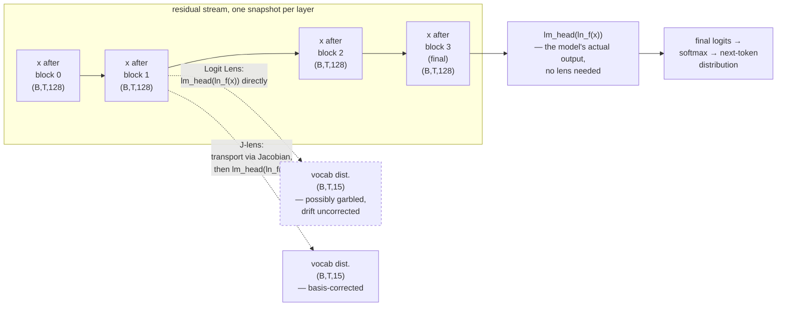

# Deep dive: looking inside — the Logit Lens, the Jacobian Lens, and Claude's 'J-space'

Chapter [04](04-model.md) walked through `minillm/model.py` top to bottom and
stopped at the output: a `(B, T, 15)` tensor of logits, produced once, at the
very end, by `self.lm_head(x)`. This deep dive asks a different question —
not "what does the model output", but "what is it computing on the way
there". It surveys a small family of interpretability techniques that try to
read the model's *intermediate* state, ends at a 2026 Anthropic result that
pushes this line of work further than it has gone before, and proposes a
concrete exercise: build the simplest member of this family on this repo's
own ~0.8M-parameter model, where — unlike at frontier scale — you can check
the answer.

This is a research survey, not a new chapter of the guided tour. It sits
outside the main sequence (00 through 10) on purpose; read it after
[04 — The model](04-model.md), whenever you want to go one layer deeper than
the pipeline itself requires.

## 1. The question: what is the model "thinking" between layers?

Look again at the shape of `GPT.forward`:

```python
x = self.transformer.drop(tok_emb + pos_emb)  # (B, T, C)
for block in self.transformer.h:
    x = block(x, record_attn=record_attn)
x = self.transformer.ln_f(x)
logits = self.lm_head(x)                      # (B, T, vocab)
```

Chapter 04 called `x` the *residual stream* — "a shared 128-lane bus" that
every block reads from and writes to by addition (`x = x + self.attn(...)`,
`x = x + self.mlp(...)`). Only two moments in this function ever touch
*vocabulary space*: the embedding lookup at the very start (`wte`, token id
→ 128-vector) and the `lm_head` projection at the very end (128-vector →
15 logits). Everything in between — four blocks deep, in this model — lives
entirely inside that 128-dimensional space, updated by addition, never
observed.

That gap is exactly where the interesting question lives. If the residual
stream after block 2 already "knows" that the next move must land in column
`A`, but the model doesn't commit to that logit until block 4, has it
already "decided", two layers early, in some sense we could in principle
read off? The residual stream is not a black box by architecture — it is
just a sequence of 128-dimensional vectors, the same kind of object the
final hidden state is. The only reason we normally only look at the *last*
one is that `lm_head` is defined to consume the last one. Nothing stops us,
in principle, from applying `lm_head` — or something *like* `lm_head` — to
an *earlier* one, and asking what vocabulary distribution falls out.

That move — decode an intermediate layer as if it were the final layer — is
the entire idea behind everything that follows in this chapter. The
techniques below differ only in how carefully they do that decoding, and
what they conclude from the result.

## 2. The Logit Lens: reading an unfinished thought

The simplest version of this idea is already five years old and needs no
retraining, no extra parameters, and no new code path: **the Logit Lens**,
introduced by the pseudonymous researcher nostalgebraist in a 2020 LessWrong
post. The recipe is almost embarrassingly direct:

1. Take the residual stream `x` at some intermediate layer $\ell < n\_layer$,
   before it has passed through the remaining blocks.
2. Apply the model's own final `LayerNorm` and `lm_head` to it anyway, as if
   layer $\ell$ were the last one.
3. Read off a probability distribution over the vocabulary via softmax.

$$
p_\ell(\text{token}) = \operatorname{softmax}\!\big(\text{lm\_head}(\text{ln\_f}(x_\ell))\big)
$$

In this repo's shapes, that means taking any of the four residual-stream
snapshots `x` — after block 0, 1, 2, or 3 — each `(B, T, 128)`, and feeding
it through the same `ln_f` and `lm_head` that chapter 04 described as
running once, at the end, on the *final* `x`. Nothing about `lm_head` or
`ln_f` cares which layer produced its input; they are just a `LayerNorm` and
a `128 → 15` linear map, ready to be pointed at any 128-vector you hand
them.

The intuition this buys you: at layer $\ell$, what would the model already
"say" if you forced it to guess right now? Early layers tend to produce a
near-uniform or unstable distribution — the representation is not yet in a
form `lm_head` can read cleanly. Later layers usually converge toward the
final answer, sometimes locking in the top token several layers before the
last one. The name is apt: you are looking at the model's evolving guess
through a fixed lens, one that was calibrated only for the very last frame.

That calibration mismatch is also the Logit Lens's well-known weakness.
`lm_head` (tied to `wte` in this codebase, per chapter 04's weight-tying
section) is the readout the model was *trained* to make sense of only at
the final layer, after `ln_f`. Nothing forces intermediate layers to already
live in that same coordinate system — the residual stream is free to
represent things in a basis that only becomes "vocabulary-shaped" near the
end. So the Logit Lens is naive but not unreasonable: it is cheap,
requires nothing beyond the model's own weights, and it is honest about
its own crudeness — it does not claim to correct for representational
drift across layers, it just applies the final readout early and reports
whatever comes out, garbled or not.

### Advanced exercise: build a Logit Lens on this repo, and check it

Every other interpretability tool this codebase ships — `inspect_attention.py`
— already stashes intermediate state (`record_attn=True` captures each
head's post-softmax attention pattern via `last_attn`). Doing the same for
the residual stream is a small, well-scoped addition, and this repo has
something almost no real interpretability project has: an exact,
enumerable oracle. `minillm/solver.py`'s negamax search knows, for any
`(B, T, 128)` prefix, exactly which continuations are legal and which are
solver-optimal. That means a Logit Lens built here is not just a curiosity
— its every claim is checkable.

A sketch, in the spirit of `inspect_attention.py`'s `--moves` CLI:

1. In `GPT.forward` (or a small wrapper script, to avoid touching
   `minillm/model.py` for an exploratory tool), stash the residual stream
   `x` after each block, the same way `record_attn` stashes attention.
2. For each stashed `x_\ell`, compute `logits_\ell = lm_head(ln_f(x_\ell))`
   and `softmax` it — four extra `(B, T, 15)` tensors, at negligible cost
   given the model's size.
3. Load a finetuned checkpoint, feed it a real game prefix (e.g. `B1 A1
   B2`, the same one chapter 04 inspects), and print the top-1 token per
   layer, per position — a small table, four rows (layers) by however many
   columns (positions) the prefix has.
4. Compare each layer's top-1 guess against `minillm/solver.py`'s verdict
   for that exact position: is the move legal? Is it solver-optimal? Does
   the *early*-layer guess already agree with the *final* one, or does it
   change its mind partway through the stack?

Because `vocab_size` here is 15, not 50,257, "read off the top-1 token"
is a table you can eyeball directly, and because `minillm/solver.py` is
exhaustive, "is this guess right" is never a matter of judgment. That
combination — small vocabulary, exact oracle — is what makes this exercise
worth doing here specifically, and it is also the running theme of section
4 below.

## 3. The Jacobian Lens and J-space: Anthropic, July 2026

Global Workspace Theory itself is not new. It is a decades-old framework in
neuroscience and cognitive science, associated with Bernard Baars and later
Stanislas Dehaene, roughly proposing that the brain runs many specialized
processes in parallel "backstage", and only a small subset of that activity
gets "broadcast" to a shared workspace — becoming available for report,
deliberation, and flexible reuse across otherwise-separate modules. What
*is* new, as of a July 6, 2026 paper on the Transformer Circuits Thread —
*Verbalizable Representations Form a Global Workspace in Language Models*,
by a 16-author Anthropic team including Wes Gurnee, Jack Lindsey, Joshua
Batson, and Emmanuel Ameisen — is a technique for finding something
structurally similar to that workspace inside a language model, and
evidence that it exists.

### The Jacobian Lens: a principled correction to the Logit Lens

The paper's own framing, per Anthropic's research summary, is that the
**Jacobian Lens (J-lens)** is "a principled refinement of the logit lens".
The problem it fixes is exactly the one section 2 flagged: an intermediate
residual-stream vector is not, in general, already expressed in the basis
`lm_head` expects. The Logit Lens applies `lm_head` anyway and accepts
whatever noise that mismatch introduces. The J-lens instead first
*transports* the intermediate vector into the final layer's basis —
estimating, via a first-order (Jacobian-based) approximation of how that
activation causally propagates forward and affects later output-token
probabilities, a linear correction for the representational drift between
layer $\ell$ and the final layer — and only then decodes the transported
vector through the model's own unembedding.

Schematically, where the Logit Lens computes
$p_\ell = \operatorname{softmax}(\text{lm\_head}(x_\ell))$ directly, the
J-lens instead computes something closer to

$$
p_\ell^{\,J} = \operatorname{softmax}\!\big(\text{lm\_head}(J_\ell \, x_\ell)\big)
$$

where $J_\ell$ is a Jacobian-derived linear map estimating how a
perturbation to the residual stream at layer $\ell$ propagates to the
final-layer representation, correcting for the basis drift the naive Logit
Lens ignores. The two lenses agree closely near the final layers, where
there is little drift left to correct — but diverge in early and middle
layers, where the paper reports the J-lens recovers interpretable,
word-like content that the naive Logit Lens misses or garbles outright.

### J-space: a small, privileged subspace

Applying the J-lens across many layers and prompts, the paper reports
identifying a small, sparse subspace of Claude models' residual-stream
activations — dubbed **J-space** — that behaves differently from the rest
of the network's internal activity. J-space is described as holding a
small, evolving set of unspoken, word-like concepts the model is currently
"reasoning with": not literal echoes of the input tokens, and not merely
the raw next-token prediction, but concepts available for verbal report and
flexible reuse elsewhere in the computation.

The paper argues these J-space representations satisfy several functional
criteria associated with a global workspace:

- **Verbalizable / reportable** — the model can put these concepts into
  words when asked.
- **Subject to directed modulation** — the model can deliberately hold or
  manipulate what sits in this subspace, not just passively generate it.
- **Used in multi-step, silent internal reasoning** — J-space content
  participates in reasoning that happens before any token is emitted.
- **Flexibly generalizable across contexts** — the same kind of
  representation recurs across otherwise unrelated prompts.
- **Selective** — most of the model's internal activity does *not* pass
  through this channel. J-space is small and sparse by construction; the
  bulk of the network's computation stays outside it.

That last property is the load-bearing one for the analogy that follows:
a global workspace, in the neuroscience sense, is defined as much by what
it *excludes* as by what it carries.

> **Careful, deliberately narrow analogy — read this before the next
> paragraph.** Anthropic's own framing draws a functional parallel to
> "access consciousness" — the idea, from Global Workspace Theory, that
> information becoming available for report and cross-module reuse is what
> philosophers of mind call functionally "conscious", as distinct from
> *phenomenal* consciousness (subjective experience — what it is "like" to
> be something). The paper's claim is about information routing: content
> that reaches J-space is available to the model's reportable/reasoning
> channel, loosely analogous to conscious access; content processed
> elsewhere that never surfaces in J-space is described as behaving
> "subconsciously" in the narrow sense of being present and causally
> influential but never available for report or flexible reuse. This is
> explicitly *not* a claim about subjective experience.

!!! danger "This does not show Claude is conscious — read before drawing conclusions"
    Anthropic's own research page states directly: **"Our experiments
    don't show Claude can have experiences, or feel things in the way
    humans do."** The authors say they "take no position" on whether
    functional access consciousness implies anything about phenomenal
    consciousness, and note that "the philosophical implications of this
    connection are unclear and likely controversial." Both Anthropic and
    outside science journalism are explicit that the psychology and
    neuroscience vocabulary here — *workspace*, *conscious access*,
    *subconscious* — is a **functional analogy about information
    routing**, not a literal biological or phenomenological claim.
    Language models are not brains.

    Outside commentary sharpens the caveat further. Tom McGrath (Goodfire),
    quoted in MIT Technology Review's coverage, compares the J-lens to "a
    flashlight rather than an overhead lamp": the absence of a signal in
    J-space does not prove the absence of the underlying process, so the
    technique can find things but cannot be used to *rule things out*. The
    same reporting frames striking examples — words like "panic" or "fake"
    surfacing in J-space around a model's decision to fabricate something —
    as "a (very) sophisticated form of word association" rather than
    evidence of intentional deception or feeling, flagging a real risk of
    reading more into these traces than the method supports. Anthropic
    itself is calling for input from philosophers, scientists, religious
    leaders, governments, and the public on the underlying question — which
    is itself a signal that this is being treated as an open, unresolved
    issue, not a settled finding.

**What's established vs. what's new, stated plainly:**

| | Established (pre-2026) | New (July 2026) |
|---|---|---|
| Logit Lens | nostalgebraist, 2020 — apply final unembedding to intermediate activations, no correction for basis drift | — |
| Global Workspace Theory | Decades old — Baars, Dehaene et al., a neuroscience/cognitive-science framework, not invented by Anthropic | — |
| Jacobian Lens | — | A mathematically motivated, Jacobian-based correction to the Logit Lens, reliable in middle layers where the naive lens breaks down |
| J-space | — | Empirical discovery of a small, causally verified subspace in Claude models satisfying multiple global-workspace criteria |
| Access-consciousness analogy | — | Explicit, hedged functional analogy, paired with strong caveats against inferring phenomenal consciousness |

Primary sources, for anyone who wants to read past this summary:

- Anthropic, *Verbalizable Representations Form a Global Workspace in
  Language Models* (full paper, Transformer Circuits Thread, July 6, 2026):
  <https://transformer-circuits.pub/2026/workspace/index.html>
- Anthropic, *A Global Workspace in Language Models* (research summary):
  <https://www.anthropic.com/research/global-workspace>
- Companion code repository, `jacobian-lens`:
  <https://github.com/anthropics/jacobian-lens>
- MIT Technology Review, *Anthropic found a hidden space where Claude
  puzzles over concepts* (critical coverage):
  <https://www.technologyreview.com/2026/07/09/1140293/anthropic-found-a-hidden-space-where-claude-puzzles-over-concepts/>
- External commentary PDF hosted by Anthropic (outside researcher
  reactions):
  <https://www-cdn.anthropic.com/files/4zrzovbb/website/cc4be2488d65e54a6ed06492f8968398ddc18ebe.pdf>

## The lens family, end to end

Both lenses share the same shape: pull a vector out of the residual stream
partway through the stack, map it (directly, or via a learned correction)
into the same coordinate system the final unembedding expects, and read off
a distribution over the vocabulary. The Logit Lens skips the correction
step; the J-lens is precisely that correction, done properly.



At the final layer, both lenses collapse to exactly what the model already
does — that's `GPT.forward`'s own `lm_head(x)` call, no lens required. The
entire point of a lens is to peek at layers *before* that, where the
un-transported Logit Lens is, by the paper's own account, unreliable, and
where the J-lens is built to still make sense.

## 4. Why this repo is the ideal lens sandbox

Every lens in this family ultimately answers the same question: does this
intermediate representation correspond to a real concept the model is
tracking, or is it noise the readout happened to produce? At frontier
scale, answering that question with confidence is close to impossible —
the vocabulary has 50,000+ entries, the "concepts" a model like Claude
might track are open-ended and not enumerable, and there is no oracle that
can tell you, for an arbitrary prompt, exactly which latent facts *should*
be recoverable at layer 40 of 80. Anthropic's own paper leans on causal
interventions and large-scale statistical evidence precisely because there
is no ground truth to check against directly — which is exactly why
outside researchers like Tom McGrath (section 3) caution that the method
can find signal but cannot rule things out with certainty.

This repo does not have that problem. `minillm/solver.py` is an exhaustive
negamax search over all 694 reachable positions and 1,310 complete games
— for any prefix the model has ever seen or could ever see, the ground
truth is not estimated, it is *computed exactly*: which moves are legal,
which move is solver-optimal, who is winning, and by how much. The
vocabulary is 15 tokens, not 50,257 — an entire lens output fits in a
single printed table. And the model is four layers deep, so "does the
early-layer guess already match the final one" is a question with at most
four possible answers per position, not forty.

That combination — a tiny, exactly-solved world, and a model too small to
hide anything statistically — is a luxury no frontier-scale interpretability
project gets. Applying a Logit Lens (or, as a further exercise, a small
Jacobian-style correction) to this codebase is not just a toy re-enactment
of Anthropic's method; it is a setting where you can build the lens *and*
grade its homework, layer by layer, against an oracle that is never wrong.
Chapter 04's attention inspection already demonstrated the pattern once —
watching layer 1 head 1 discover, unsupervised, that `B2` depends on `B1`
being played first, and confirming it against the game's actual gravity
rule. A residual-stream lens is the natural next experiment in exactly that
spirit: not "does this look interpretable", but "is this reading correct,
checked against a solver that cannot be argued with".

## Next

- [04 — The Transformer, spelled out](04-model.md) — the residual stream,
  the tied `lm_head`, and the attention inspection this chapter builds on.
- [Anatomy](anatomy.md) — the full shape reference for every tensor named
  above.
- [Glossary](glossary.md) — plain-English definitions of residual stream,
  logits/softmax, embedding, and every other term this chapter assumes.
