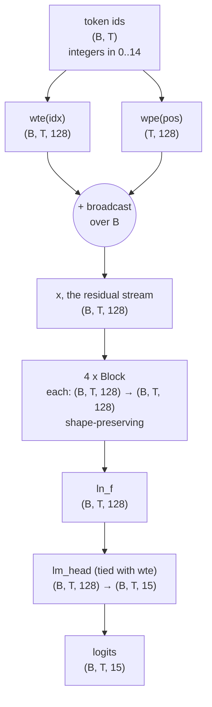
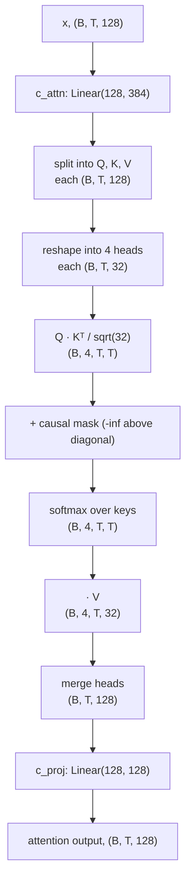

# Deep dive: the mathematics — tensors, matrices, and the formulas behind every layer

[04 — The model](04-model.md) walks `minillm/model.py` top to bottom in prose,
tied to real tensor shapes. [Anatomy](anatomy.md) does the same at zero-math
altitude, one plain-language question per part. This page is the excursion in
between and above both: every formula, written out in full, with the exact
shapes and numbers this ~0.8M-parameter model runs at — nothing invented,
nothing approximated. Read it with `minillm/model.py` and `minillm/config.py`
open; every section names the line it explains.

If a symbol looks unfamiliar, the [glossary](glossary.md) defines its
plain-English meaning; this page assumes you already know *what* attention or
a residual stream is for and want to see the arithmetic underneath.

## 1. Tensors and shapes

A **scalar** is a single number ($0$-dimensional). A **vector** is a list of
numbers ($1$-dimensional, one axis). A **matrix** is a 2-D grid of numbers
(rows and columns). A **tensor** is the general case: an array with any
number of axes ("rank" or "order"). Vectors and matrices are just tensors of
rank 1 and 2; a batch of token embeddings is rank 3. Everything this model
computes is tensor arithmetic — matrix multiplications, element-wise
additions, and one normalization — and every intermediate is describable by
its shape alone, which is why `docs/04-model.md` and the code comments are
so obsessive about writing shapes next to every line.

The fixed numbers, read directly from `ModelConfig` in `minillm/config.py`:

| symbol | name | value | where |
|---|---|---:|---|
| `vocab_size` | tokens in the vocabulary | $15$ | `config.py:18` |
| `block_size` | max sequence length | $16$ | `config.py:19` |
| `n_layer` | stacked Transformer blocks | $4$ | `config.py:20` |
| `n_head` | attention heads per block | $4$ | `config.py:21` |
| `n_embd` ($C$) | width of the residual stream | $128$ | `config.py:22` |
| `hs` (head size) | $C / \text{n\_head}$ | $32$ | derived, `model.py:73` |

$B$ (batch size) and $T$ (sequence length, $T \le 16$) are runtime values,
not config fields — they come from whatever tensor is passed to `forward`.

The exact shape trajectory of one forward pass, `GPT.forward` in
`minillm/model.py` (lines 201–219):



Notice the one structurally important fact this diagram makes visible: every
Transformer block is **shape-preserving** — $(B, T, C) \to (B, T, C)$, always
$128 \to 128$. Depth is added by stacking more shape-preserving blocks, never
by widening the stream mid-way. Only two places in the whole network change
the last dimension: the embeddings ($15 \to 128$ and, separately, position
index $\to 128$) at the start, and `lm_head` ($128 \to 15$) at the end.

Inside a block, attention briefly explodes $C$ into $3C = 384$ (for Q, K, V
fused) and the MLP briefly expands $C$ into $4C = 512$ — but both always
project back down to $C = 128$ before the residual add, which is what keeps
the outer shape invariant. Those two detours are sections 3 and 4 below.

## 2. Embedding as a matrix multiply

A token id is an integer, e.g. `B2` $= 7$ (`minillm/tokenizer.py`). Integers
have no geometry — id $7$ is not "close to" id $6$ in any sense a network can
use. The embedding table trades each id for a learned row vector. Concretely,
`wte` is `nn.Embedding(15, 128)`: a matrix

$$
W_E \in \mathbb{R}^{15 \times 128}
$$

`nn.Embedding` looks up row `idx` directly — but that lookup *is* a matrix
multiply in disguise. Represent token id $i$ as a **one-hot** row vector
$e_i \in \mathbb{R}^{15}$ (all zeros except a $1$ at position $i$). Then

$$
\text{embedding}(i) = e_i\, W_E \in \mathbb{R}^{128}
$$

picks out exactly row $i$ of $W_E$, because every other row is multiplied by
zero. `nn.Embedding` skips building the one-hot vector and indexes directly
for speed — mathematically identical, computationally cheaper (no $15 \times
128$ matmul with $14$ wasted rows, just one row copy). For a whole sequence
of $T$ ids stacked into a $(T, 15)$ one-hot matrix $E$:

$$
\text{TokEmb} = E \, W_E \in \mathbb{R}^{T \times 128}
$$

Position embeddings work identically over a *different* table, `wpe =
nn.Embedding(16, 128)`, i.e. $W_P \in \mathbb{R}^{16 \times 128}$, indexed by
`pos = torch.arange(T)` — the position table only needs $\text{block\_size} =
16$ rows because no sequence in this model is ever longer. The two are
**added**, not concatenated (`model.py:207`):

$$
x^{(0)} = \text{TokEmb} + \text{PosEmb} \in \mathbb{R}^{B \times T \times 128}
$$

Addition (rather than concatenation) works because the $128$ dimensions are
free to split into a "what" subspace and a "where" subspace if gradient
descent finds that useful — nothing forces a fixed split, and there is no
extra parameter cost for combining the two signals this way.

## 3. Linear layers and matmul

Every non-attention, non-normalization operation in this model is an affine
map: `nn.Linear(in_features, out_features)` computes

$$
y = x W^{\top} + b, \qquad W \in \mathbb{R}^{\text{out} \times \text{in}}, \quad b \in \mathbb{R}^{\text{out}}
$$

applied independently to the last axis of whatever tensor comes in — a
$(B, T, \text{in})$ tensor becomes $(B, T, \text{out})$, with every one of
the $B \cdot T$ position-vectors going through the *same* $W$ and $b$. This
is what "position-wise" means: no cross-token mixing happens inside a
linear layer, only inside attention (section 4).

The `MLP` class (`model.py:103–119`) is two such layers with a nonlinearity
between them — the "expand, then contract" pattern used throughout GPT-2-style
models:

$$
\text{MLP}(x) = W_{\text{down}}\,\mathrm{GELU}\!\left(W_{\text{up}}\,x + b_{\text{up}}\right) + b_{\text{down}}
$$

with, in this model,

$$
W_{\text{up}} \in \mathbb{R}^{512 \times 128}\ (\texttt{c\_fc}), \qquad
W_{\text{down}} \in \mathbb{R}^{128 \times 512}\ (\texttt{c\_proj})
$$

The $4\times$ expansion factor ($128 \to 512 \to 128$) is a fixed GPT-2
convention, not derived from anything about this task — `config.py` does not
even expose it as a knob; `MLP.__init__` hardcodes `4 * config.n_embd`. GELU
is the smooth nonlinearity (`nn.GELU()`, `model.py:114`) that gives the
otherwise-linear expand/contract pair any expressive power at all; without
it, two stacked linear layers would collapse into one linear layer, no matter
how wide the middle.

## 4. Self-attention, the full formula

This is the only place in the network where information moves *between*
positions — every other op (embeddings, MLP, LayerNorm) acts on each
position independently. The textbook formula, implemented literally by
`CausalSelfAttention.forward` (`model.py:71–100`):

$$
\mathrm{Attention}(Q,K,V)=\mathrm{softmax}\!\left(\frac{QK^{\top}}{\sqrt{d_k}} + M\right)V
$$

where $M$ is the causal mask (introduced below; the textbook version usually
omits it, but this model needs it, so it is written in explicitly). Here is
every symbol, traced to its line of code.

### Q, K, V — one fused projection

```python
self.c_attn = nn.Linear(config.n_embd, 3 * config.n_embd)   # model.py:56
...
q, k, v = self.c_attn(x).split(C, dim=2)                    # model.py:77
```

One matrix $W_{QKV} \in \mathbb{R}^{384 \times 128}$ maps each position
vector $x_t \in \mathbb{R}^{128}$ to a $384$-vector, immediately split into
three $128$-vectors:

$$
[\,q_t \mid k_t \mid v_t\,] = W_{QKV}\,x_t + b_{QKV}, \qquad q_t, k_t, v_t \in \mathbb{R}^{128}
$$

For a whole sequence this is $Q, K, V \in \mathbb{R}^{T \times 128}$ (per
batch element). Fusing three $128 \to 128$ matmuls into one $128 \to 384$
matmul is a pure efficiency idiom — one kernel launch instead of three — and
is bit-for-bit equivalent to three separate linears; the name `c_attn`
matches GPT-2's original variable name.

### Splitting into heads

```python
q = q.view(B, T, nh, hs).transpose(1, 2)
```

$Q \in \mathbb{R}^{T \times 128}$ is *reinterpreted* (no computation) as
$\text{n\_head} = 4$ independent matrices $Q^{(h)} \in \mathbb{R}^{T \times
32}$, $h = 1..4$, each living in its own $32$-dimensional subspace of the
$128$ channels. Everything from here runs once per head, in parallel, with
its own $Q^{(h)}, K^{(h)}, V^{(h)}$.

### Scores and the $\sqrt{d_k}$ scaling

```python
att = (q @ k.transpose(-2, -1)) / math.sqrt(hs)   # model.py:86
```

Per head, this computes the raw compatibility of every query against every
key:

$$
S^{(h)} = \frac{Q^{(h)} {K^{(h)}}^{\top}}{\sqrt{d_k}} \in \mathbb{R}^{T \times T}, \qquad d_k = hs = 32
$$

$S^{(h)}_{ij} = \dfrac{q_i^{(h)} \cdot k_j^{(h)}}{\sqrt{32}}$ is the raw
attention score of query position $i$ against key position $j$.

Why divide by $\sqrt{d_k}$? Take $q, k \in \mathbb{R}^{32}$ with independent,
roughly unit-variance components. Their dot product $q \cdot k =
\sum_{c=1}^{32} q_c k_c$ is a sum of $32$ roughly-independent terms, so its
variance grows with $d_k$:

$$
\mathrm{Var}(q \cdot k) \approx d_k \implies \mathrm{sd}(q \cdot k) \approx \sqrt{d_k} = \sqrt{32} \approx 5.7
$$

Feeding scores of that magnitude into softmax saturates it — one entry gets
weight $\approx 1$, the rest $\approx 0$, and the gradient through softmax
vanishes almost everywhere. Dividing every score by $\sqrt{d_k}$ rescales the
variance back down to $\approx 1$, keeping softmax in the regime where
gradients are informative. `model.py`'s own comment (`model.py:84–85`) says
the same thing in prose: "keeps the dot products in a range where softmax
still has usable gradients."

### Causal mask: $-\infty$ before softmax

```python
mask = torch.tril(torch.ones(config.block_size, config.block_size))   # model.py:65
...
att = att.masked_fill(self.causal_mask[:, :, :T, :T] == 0, float("-inf"))  # model.py:90
```

Define $M \in \mathbb{R}^{T \times T}$:

$$
M_{ij} = \begin{cases} 0 & j \le i \\ -\infty & j > i \end{cases}
$$

so the masked scores are $S^{(h)} + M$. This forbids position $i$ from
attending to any future position $j > i$: since $\exp(-\infty) = 0$ exactly,
softmax gives those entries exactly zero weight, and the row still sums to
$1$ over the *allowed* positions only. Masking must happen **before**
softmax, not after — zeroing weights post-softmax would leave the row
summing to less than $1$, silently rescaling the distribution in a way that
depends on how many positions were masked. `torch.tril` builds the
lower-triangular pattern once at construction time and stores it as a
`register_buffer` (`model.py:66`) — a constant tensor, saved in checkpoints,
never touched by the optimizer.

### Softmax

```python
att = F.softmax(att, dim=-1)   # model.py:91
```

For a row of scores $s = (s_1, \dots, s_T)$ (with masked entries at
$-\infty$):

$$
\mathrm{softmax}(s)_j = \frac{e^{s_j}}{\sum_{k=1}^{T} e^{s_k}}
$$

This turns arbitrary real-valued scores into a probability distribution:
every entry positive, the row summing to exactly $1$. Row $i$ of
$\mathrm{softmax}(S^{(h)} + M)$ is head $h$'s attention distribution for
query position $i$ over all *allowed* key positions $j \le i$ — the numbers
printed in the attention-matrix examples in `docs/04-model.md`
("`B2` → `B1`: 0.80").

### Weighted sum and head merge

```python
y = att @ v                                          # model.py:98
y = y.transpose(1, 2).contiguous().view(B, T, C)      # model.py:99
return self.resid_dropout(self.c_proj(y))             # model.py:100
```

$$
O^{(h)} = A^{(h)} V^{(h)} \in \mathbb{R}^{T \times 32}, \qquad A^{(h)} = \mathrm{softmax}(S^{(h)} + M)
$$

Each output row is a weighted average of value vectors, weighted by that
row's attention distribution. The four heads' outputs are concatenated back
into $\mathbb{R}^{T \times 128}$ (the exact inverse of the earlier split),
then mixed by one more linear layer:

$$
\mathrm{Attn}(x) = \big[\,O^{(1)} \mid O^{(2)} \mid O^{(3)} \mid O^{(4)}\,\big]\, W_{\text{proj}}^{\top} + b_{\text{proj}}, \qquad W_{\text{proj}} \in \mathbb{R}^{128 \times 128}
$$

Without `c_proj`, head $1$'s output could only ever land in channels
$0$–$31$ of the residual stream; the projection lets every head write to
every channel.

### Multi-head attention diagram



> **The formula in full, this model's numbers substituted:**
> $$
> \mathrm{Attention}(Q,K,V) = \mathrm{softmax}\!\left(\frac{QK^{\top}}{\sqrt{32}} + M\right)V, \qquad Q,K,V \in \mathbb{R}^{T \times 32}\ \text{per head, 4 heads, } T \le 16
> $$

## 5. LayerNorm

Applied twice per block, before attention and before the MLP
(`model.py:132,134`, `nn.LayerNorm(config.n_embd)`), and once more at the
very end (`ln_f`). For a single position's vector $x \in \mathbb{R}^{128}$,
LayerNorm normalizes across the $128$ channels (not across the batch, and
not across time — each token position is normalized independently):

$$
\mu = \frac{1}{C}\sum_{c=1}^{C} x_c, \qquad
\sigma^2 = \frac{1}{C}\sum_{c=1}^{C} (x_c - \mu)^2
$$

$$
\mathrm{LayerNorm}(x)_c = \gamma_c \cdot \frac{x_c - \mu}{\sqrt{\sigma^2 + \epsilon}} + \beta_c
$$

with $C = 128$, $\epsilon$ a small constant for numerical stability, and
$\gamma, \beta \in \mathbb{R}^{128}$ learned per-channel scale and shift
(PyTorch's default LayerNorm parameters — $\gamma$ initialized to $1$,
$\beta$ to $0$). This is what fixes each position's activations to
zero mean, unit variance before every sublayer regardless of how large the
residual stream has grown by that depth — stabilizing the scale attention
and the MLP each see as input. `Block.forward` (`model.py:137–140`) applies
it in the **pre-norm** position, i.e. `self.ln_1(x)` is normalized before
attention runs, and the *unnormalized* `x` is what gets the residual add:

$$
x \leftarrow x + \mathrm{Attn}\big(\mathrm{LN}_1(x)\big), \qquad
x \leftarrow x + \mathrm{MLP}\big(\mathrm{LN}_2(x)\big)
$$

so the residual stream itself is never normalized, only the copy each
sublayer reads.

## 6. Cross-entropy / negative log-likelihood loss

`GPT.forward`, training mode (`model.py:212–217`):

```python
logits = self.lm_head(x)  # (B, T, vocab)
loss = F.cross_entropy(
    logits.view(-1, logits.size(-1)), targets.reshape(-1), ignore_index=-1
)
```

For one token position with true next-token id $y$ and logits $z \in
\mathbb{R}^{15}$, the model's predicted probability of the correct token,
via softmax, is

$$
p(y) = \frac{e^{z_y}}{\sum_{k=1}^{15} e^{z_k}}
$$

and the per-token loss is the negative log of that probability:

$$
\mathcal{L} = -\log p(y)
$$

A confident, correct prediction ($p(y) \to 1$) drives $\mathcal{L} \to 0$; a
confident, wrong prediction drives $\mathcal{L} \to \infty$. `F.cross_entropy`
computes exactly this, then **averages** over every non-ignored position in
the flattened $(B \cdot T,)$ batch — which is why the loss is a single
scalar regardless of $B$ or $T$. `ignore_index=-1` drops any position whose
target was set to $-1$ from that average entirely (`minillm/dataset.py`
padding, and in finetuning, opponent-move masking): those positions
contribute zero gradient, as if they were never in the batch.

The unit is **nats** (natural-log units, because `F.cross_entropy` uses
$\ln$, not $\log_2$). A uniformly random guess over $15$ tokens scores

$$
-\ln\frac{1}{15} = \ln(15) \approx 2.708 \text{ nats}
$$

— the "clueless baseline" the glossary cites. But raw per-token loss is not
comparable across tokenizers with different token counts per game
([09 — Lab report](09-char-tokenizer-lab.md)): the move-level vocabulary
needs about $10.1$ targets per game, the char-level one about $19.2$. The
fix is to renormalize to a per-*game* quantity by multiplying back out:

$$
\text{nats/game} = \mathcal{L}_{\text{per-token}} \times (\text{targets per game})
$$

which is exactly how `docs/09-char-tokenizer-lab.md` reconciles the
move-level pretrain loss ($0.7506 \times 10.1 \approx 7.6$ nats/game) against
the char-level one ($0.3835 \times 19.2 \approx 7.4$ nats/game) — nearly
identical once the denominator is made to match, "same knowledge, different
denominators."

## 7. Gradients and backprop

Training needs $\partial \mathcal{L} / \partial \theta$ for every parameter
$\theta$ — every entry of every weight matrix and bias in the model. Nothing
in `minillm/model.py` computes a gradient by hand; the forward pass above
*is* the entire specification, because every operation used (`nn.Linear`,
matrix multiply, softmax, LayerNorm, GELU, addition) is a composition of
differentiable primitives that PyTorch's autograd already knows the
derivative of. The **chain rule** is the only calculus fact this rests on:
for a composition $\mathcal{L} = f(g(h(x)))$,

$$
\frac{\partial \mathcal{L}}{\partial x} = \frac{\partial f}{\partial g}\cdot\frac{\partial g}{\partial h}\cdot\frac{\partial h}{\partial x}
$$

Autograd walks the forward computation graph — embeddings, four blocks, each
with its attention and MLP sublayers, final LayerNorm, `lm_head`, softmax,
log, negate, average — backward exactly once, multiplying local derivatives
at each step, and accumulates the result into `.grad` on every leaf
parameter tensor. This is why the residual connections
($x \leftarrow x + \text{sublayer}(x)$, section 5 and
[04 — The model](04-model.md#the-residual-stream-the-central-highway)) matter
so much for trainability: the derivative of $x + f(x)$ with respect to $x$
always contains a $+1$ term regardless of how small $\partial f/\partial x$
is, so gradients have an unobstructed path back to the embeddings no matter
how deep the stack — no vanishing-gradient bottleneck from depth alone.

`GPT.configure_optimizer` (`model.py:221–237`) hands those accumulated
gradients to **AdamW**: for each parameter it keeps a running average of the
gradient (first moment, "momentum") and of the squared gradient (second
moment), uses the ratio of the two to give every parameter its own adaptive
step size, and — the "W" — subtracts a weight-decay term proportional to the
parameter's own value *directly*, decoupled from the gradient-based update
(unlike plain Adam with L2 regularization folded into the gradient). Decay is
applied only to parameters with $\ge 2$ dimensions — the big matmul matrices
— never to LayerNorm's $\gamma/\beta$ or to biases, per the `decay` /
`no_decay` split at `model.py:231–232`.

## 8. Parameter count as a formula

Every weight in this model belongs to one of a small number of tensor
shapes, entirely determined by `ModelConfig`. Writing $V = 15$
(`vocab_size`), $P = 16$ (`block_size`), $C = 128$ (`n_embd`), $L = 4$
(`n_layer`):

**Embeddings** — `wte` and `wpe` (`lm_head` is tied to `wte`, contributing
no separate parameters, `model.py:163`):

$$
N_{\text{emb}} = \underbrace{V \cdot C}_{\text{wte, tied}} + \underbrace{P \cdot C}_{\text{wpe}}
$$

**Per block** — one attention sublayer plus one MLP sublayer, each with its
own preceding LayerNorm ($2C$ params: $\gamma$ and $\beta$):

$$
N_{\text{attn}} = \underbrace{2C}_{\text{ln\_1}} + \underbrace{(C)(3C) + 3C}_{\text{c\_attn}} + \underbrace{(C)(C) + C}_{\text{c\_proj}}
$$

$$
N_{\text{mlp}} = \underbrace{2C}_{\text{ln\_2}} + \underbrace{(C)(4C) + 4C}_{\text{c\_fc}} + \underbrace{(4C)(C) + C}_{\text{c\_proj}}
$$

$$
N_{\text{block}} = N_{\text{attn}} + N_{\text{mlp}}
$$

**Total**, plus the final LayerNorm:

$$
N_{\text{total}} = N_{\text{emb}} + L \cdot N_{\text{block}} + \underbrace{2C}_{\text{ln\_f}}
$$

Substituting $V=15$, $P=16$, $C=128$, $L=4$:

$$
N_{\text{emb}} = 15 \cdot 128 + 16 \cdot 128 = 1{,}920 + 2{,}048 = 3{,}968
$$

$$
N_{\text{attn}} = 256 + (128 \cdot 384 + 384) + (128 \cdot 128 + 128) = 256 + 49{,}536 + 16{,}512 = 66{,}304
$$

$$
N_{\text{mlp}} = 256 + (128 \cdot 512 + 512) + (512 \cdot 128 + 128) = 256 + 66{,}048 + 65{,}664 = 131{,}968
$$

$$
N_{\text{block}} = 66{,}304 + 131{,}968 = 198{,}272
$$

$$
N_{\text{total}} = 3{,}968 + 4 \cdot 198{,}272 + 256 = 3{,}968 + 793{,}088 + 256 = 797{,}312
$$

This matches `GPT(ModelConfig()).num_params()` exactly — verified by running
it against the code:

```
total 797312
Counter({'blocks': 793088, 'wpe': 2048, 'wte': 1920, 'ln_f': 256})
```

$797{,}312 \approx 0.8 \times 10^6$, the "~0.8M parameters" the module
docstring and README both cite. The formula also explains, without appeal to
this specific run, *why* the blocks dominate: $N_{\text{block}}$ grows as
$C^2$ (dominated by the $4C \times C$ MLP matrices) while $N_{\text{emb}}$
grows only as $C$ — at $C=128$ with a $15$-token vocabulary the block terms
already outweigh the embeddings by roughly $200{:}1$; at GPT-2's $C=768$,
$V=50{,}257$ the much larger vocabulary keeps embeddings a full third of the
model instead. Full tensor-by-tensor breakdown, same numbers, in
[04 — The model](04-model.md#parameter-count-where-the-797312-live).

## Next

- [04 — The model](04-model.md) — the same architecture, in rigorous prose,
  with the initialization tricks, the causality proof, and real attention
  matrices printed from a trained checkpoint.
- [Anatomy](anatomy.md) — the plain-language companion: no formulas, one
  worked example (`B1 A1 B2`) followed through every part.
- [Glossary](glossary.md) — every term used above (attention, cross-entropy,
  residual stream, weight tying, ...) defined in one line and pinned to
  running code.
