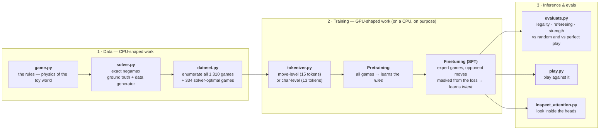
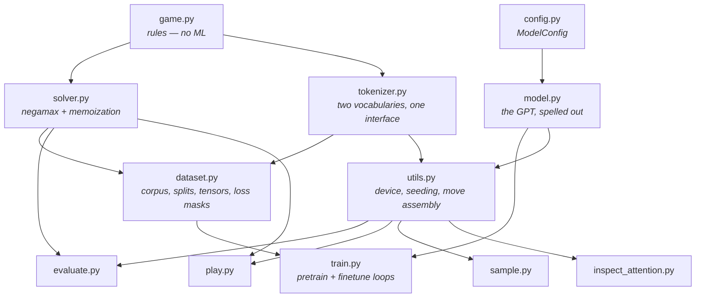
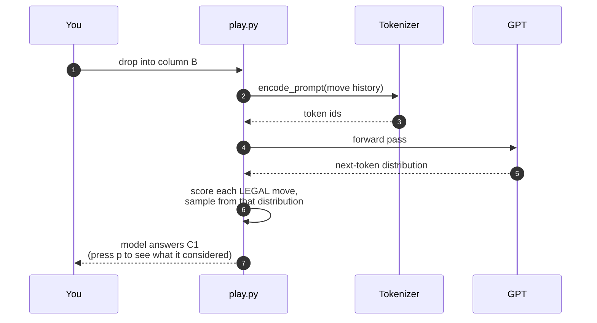

# llm-ecosphere

> A closed world, small enough to explain an LLM ecosystem completely.

Build, train, run and *understand* a language model from scratch, in
Python. The model is a real GPT — the same decoder-only Transformer
architecture as GPT-2/3, Llama or Claude, shrunk to ~0.8M parameters —
and its entire world is **Drop-Tac-Toe**: Tic-Tac-Toe on a 3×3 board with
Connect-Four gravity.

Why a game, and why *this* game? Because the game is exactly solvable,
every question about the model has a ground-truth answer. When a real LLM
says something, deciding whether it is right is itself hard. Here, an
exact solver sits next to the model and referees every claim: we can
*measure* what the model learned instead of guessing. There are exactly
**1,310 possible complete games** across **694 reachable positions** — a
closed world you can hold in your head, with a full-scale pipeline running
inside it.

## The pipeline at a glance

Every stage of a production LLM pipeline exists here, in miniature and
fully readable:



Each stage maps one-to-one onto its production counterpart:

| This repo | Real LLM pipeline |
| --------- | ----------------- |
| Enumerate all 1,310 games | Scrape a web-scale text corpus |
| 15-token move-level vocabulary | BPE tokenizer, ~100k tokens |
| Pretrain on *all* games → learns the rules | Pretraining → learns grammar/facts |
| Finetune on solver-optimal games, opponent moves masked from the loss | SFT — imitate the assistant, mask the user turns |
| Temperature / top-k sampling, legality masking | Decoding strategies, guardrails |
| Legality, refereeing, win-rate metrics | Evals and benchmarks |
| Attention inspection | Interpretability research |

## How the code fits together

Eleven small modules, no framework, no magic. Arrows mean "imports from":



The one deliberate asymmetry: `game.py` and `solver.py` know nothing about
machine learning, and `model.py` knows nothing about the game. The
tokenizer is the only bridge — exactly the role tokenizers play in real
systems.

## What one game looks like to the model

The model never sees a board. It sees text — a move sequence ending in a
result token — and learns the world from nothing else, the way a real LLM
learns everything from text:

```
<bos> B1 A1 B2 C1 B3 #X <eos>
```

When you play against it, every turn is one round of *constrained
decoding*:



## What it learns — the headline numbers

Measured, not vibes (chapter [07](07-evaluation.md) explains every metric;
training is seeded, so your numbers will match closely):

| Metric | after pretraining | after finetuning |
| ------ | ----------------: | ---------------: |
| Top-choice is a legal move (held-out) | 100.0% | 99.5% |
| Free-running legality (first try) | 99.8% | 98.8% |
| vs random player, win rate | 41.8% | 79.2% |
| vs perfect solver, draw rate | 0% | 61.0% |
| Chooses a solver-optimal move | 70.3% | 86.5% |

The story these numbers tell is the story of modern LLMs: **pretraining
teaches form** (the model plays 100% legally but only imitates the
*average* game), **finetuning teaches intent** (79% wins vs random; 61%
draws against the perfect solver — and a draw is the theoretical ceiling
of this game). Even the small legality dip after finetuning mirrors the
real-world "alignment tax".

## Quickstart

Requires [uv](https://docs.astral.sh/uv/) (or any Python 3.12).
Everything runs on plain CPU:

```bash
git clone https://github.com/yves-vogl/llm-ecosphere.git
cd llm-ecosphere
make setup      # create .venv and install torch + pytest
make test       # unit tests
make data       # enumerate every game        (seconds)
make pretrain   # learn the rules             (~2 min CPU)
make finetune   # learn to play well          (~1 min CPU)
make eval       # measure what it learned     (seconds)
make play       # play against it!
```

## How to read this documentation

The chapters are a book — each explains one pipeline stage against the
actual code, with an "In a real LLM" aside connecting it to production
scale. Read in order:

1. **[00 · Overview](00-overview.md)** — the map: what exists, why, and
   how the pieces connect.
2. **[01 · The game and its exact solver](01-the-game.md)** — the toy
   world's physics, and the negamax solver that makes everything
   measurable.
3. **[02 · From games to a training corpus](02-data.md)** — enumeration,
   splits, and what "data quality" means when you can have *all* the data.
4. **[03 · Tokenization](03-tokenization.md)** — from move strings to
   integer ids; why vocabulary design is destiny.
5. **[04 · The Transformer, spelled out](04-model.md)** — embeddings,
   attention, MLPs, residual streams: the whole GPT, line by line.
6. **[05 · Training](05-training.md)** — pretraining, then SFT-style
   finetuning with loss masking.
7. **[06 · Inference](06-inference.md)** — sampling, temperature, top-k,
   and legality-constrained decoding.
8. **[07 · Evaluation](07-evaluation.md)** — legality, refereeing,
   strength; what "measuring a model" actually takes.
9. **[08 · Exercises](08-exercises.md)** — make it yours: ablations,
   temperature sweeps, a KV cache, an RL stage.
10. **[09 · Lab report: the character-level tokenizer](09-char-tokenizer-lab.md)**
    — exercise 1, solved and measured. Spoilers; try it yourself first.
11. **[10 · Why GPUs?](10-gpu-cuda.md)** — the hardware under the
    pipeline: CPU vs GPU, memory bandwidth, and what CUDA actually is.

Teaching with this repo, or short on time? **[Learning
paths](learning-paths.md)** maps three audience-specific routes through
the chapters and includes a ready-to-run 3-hour workshop script. And when
a term stops you mid-chapter, the **[glossary](glossary.md)** grounds
every LLM concept — token, attention, loss masking, KV cache — in the
running code of this repo.

## Source

The code lives at
[github.com/yves-vogl/llm-ecosphere](https://github.com/yves-vogl/llm-ecosphere)
— MIT-licensed, contributions welcome (see
[CONTRIBUTING](https://github.com/yves-vogl/llm-ecosphere/blob/main/CONTRIBUTING.md)).
