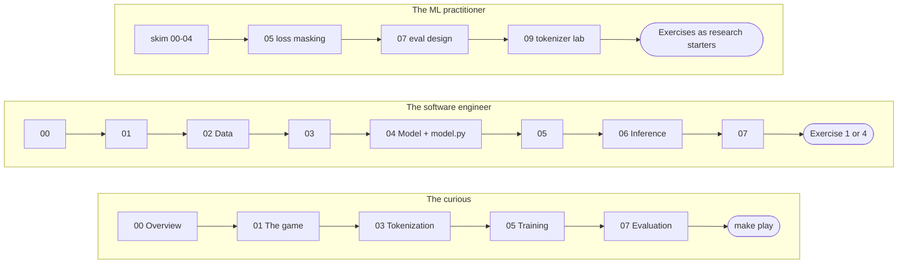

# Learning paths — how to use this repo for teaching

llm-ecosphere is a training and demo project: a real GPT, small enough that
every stage of the pipeline — data, tokenization, pretraining, finetuning,
inference, evaluation, interpretability — fits on a laptop CPU and is
readable end to end. The documentation is written as a book, meant to be
read in order once. But "in order, once" is not how most people will
actually meet this repo. A curious non-programmer, a software engineer
learning ML, and a working ML practitioner all want something different
from the same eleven chapters. This page is the map for each of them, plus
a script for running the repo as a live workshop.

## Three paths

### The curious — no ML background, maybe no Python

You want to understand what an LLM *is* — not compile anything. Read these
chapters as prose: skim past the code blocks, read the surrounding text and
the "In a real LLM" asides, which are written to stand on their own.

1. [00 — Overview](00-overview.md) — what exists here and why a toy game is
   an honest laboratory.
2. [01 — The game and its exact solver](01-the-game.md) — the rules of
   Drop-Tac-Toe, and what "exactly solvable" buys you.
3. [03 — Tokenization](03-tokenization.md) — how "B2" becomes a number a
   network can multiply. This is the closest the path gets to code; the
   vocabulary table is short enough to just look at.
4. [05 — Training](05-training.md) — read for the two-stage idea
   (pretraining learns the rules, finetuning learns to win) and skip the
   loss-function derivations.
5. [07 — Evaluation](07-evaluation.md) — read for the headline numbers and
   what they mean, not the metric implementations.

**Skip entirely:** [02 — Data](02-data.md) and [06 — Inference](06-inference.md)
(corpus-building and sampling code), [04 — The Transformer](04-model.md)
(the architecture, line by line), and [08](08-exercises.md) /
[09](09-char-tokenizer-lab.md) / [10](10-gpu-cuda.md), which all assume you
want to run or modify code.

**Hands-on anchor:** `make play`. Nothing explains "the model never sees a
board, only the move sequence" like playing it and watching it predict a
sane-looking next move purely from text. If `p` (show probabilities) is
available, use it — watching probability mass concentrate on legal moves,
then jump onto the correct result token the instant a game ends, is the
single most convincing five minutes in the repo.

**Honest time estimate:** 60–90 minutes of reading (skimming past code),
plus 15–20 minutes playing a few games. Call it two hours to leave with a
real, non-hand-wavy understanding of what an LLM does.

### The software engineer — fluent in code, new to ML

You want the whole pipeline, hands-on, and you can read Python. Follow the
reading order as written:

1. [00 — Overview](00-overview.md)
2. [01 — The game and its exact solver](01-the-game.md)
3. [02 — From games to a training corpus](02-data.md)
4. [03 — Tokenization](03-tokenization.md)
5. [04 — The Transformer, spelled out](04-model.md) — open `minillm/model.py`
   in a second window and read it alongside this chapter, function by
   function. This is the payoff chapter for this path; nothing here should
   feel like a black box afterward.
6. [05 — Training](05-training.md)
7. [06 — Inference](06-inference.md)
8. [07 — Evaluation](07-evaluation.md)

**Don't skip anything** — the whole point of this path is the full
pipeline — but [09](09-char-tokenizer-lab.md) and
[10](10-gpu-cuda.md) are optional extensions, not prerequisites for the
core loop.

**Hands-on:** run every Makefile stage yourself (`make setup`, `make test`,
`make data`, `make pretrain`, `make finetune`, `make eval`, `make play`),
then open [08 — Exercises](08-exercises.md) and do exercise 1 (the
character-level tokenizer, tagged "an afternoon") or exercise 4 (a
temperature sweep against playing strength, tagged "30 minutes") — the
short version if you're time-boxed, the long one if you want to touch every
file that exercise 1 touches (`tokenizer.py`, `config.py`, `utils.py`,
`evaluate.py`, `play.py`). Exercise 1 has a full worked answer in
[09 — the char-tokenizer lab](09-char-tokenizer-lab.md); do the exercise
first, it spoils the fun otherwise.

**Honest time estimate:** half a day for the reading-plus-pipeline core; add
30 minutes for the temperature sweep or a full afternoon for the
character-tokenizer exercise.

### The ML practitioner

You already know what a decoder-only Transformer is. What you want is where
*this* implementation makes different choices than the frontier systems
you've read about, and where its ground-truth solver lets it measure things
a real LLM eval can only approximate.

1. Skim [00](00-overview.md), [01](01-the-game.md), [02](02-data.md),
   [03](03-tokenization.md) and [04](04-model.md) fast — the architecture
   and data pipeline are unsurprising by design (that's the point: nothing
   here should need explaining to you).
2. Read [05 — Training](05-training.md) closely for the loss-masking
   section — the finetuning stage masks the opponent's moves out of the
   loss (target `-1`, `train.py` counts only `y != -1` toward the loss),
   which the chapter connects directly to chat-SFT's user/assistant turn
   masking. This is the mechanism, not an analogy.
3. Read [07 — Evaluation](07-evaluation.md) closely for the evaluation
   *design*: why loss alone can't answer "does it play well", the
   strict-argmax move rule that separates "does it know the rules" from
   "how strong is its policy", and the free-running-vs-teacher-forced
   legality gap (exposure bias, made measurable).
4. Read [09 — the character-tokenizer lab](09-char-tokenizer-lab.md) for
   the tokenizer comparison — a controlled ablation (same seeds, same eval
   protocol) showing that the "obviously worse" tokenization improved
   free-running legality and inverted the strength-vs-random /
   draw-vs-solver trade-off, plus the note on why cross-tokenizer loss
   comparisons are meaningless without normalizing per game.
5. Then treat [08 — Exercises](08-exercises.md) as a list of research
   starters rather than homework: exercise 7 (a lookup-table baseline to
   quantify memorization vs generalization), exercise 9 (scaling the world
   past exhaustive enumeration, which changes what your eval numbers mean),
   and exercise 10 (a REINFORCE stage with a perfect reward function) are
   the ones with real research shape.

**Honest time estimate:** 60–90 minutes, most of it on chapters 05, 07 and
09; the skimmed chapters go quickly because nothing in them is new to you.

## Running it as a workshop

A script for a roughly three-hour, hands-on group session. It assumes one
presenter with a laptop (screen-shared or projected) and, ideally,
participants who can follow along on their own machines for the play/attend
parts.

### Prep before the session

- **Do this ahead of time, not live:** `make setup`. It creates the venv and
  installs `torch` + `pytest` — a network-dependent step you don't want to
  be waiting on in front of a room.
- **Recommended safety net:** run the full pipeline once before the session
  (`make data`, `make pretrain`, `make finetune`, `make eval`) so `runs/`
  already holds a trained checkpoint and eval JSON before anyone arrives.
  If a live run glitches, stalls, or a laptop is slower than expected, you
  can fall back to the pre-baked results without derailing the session.
- **But the live run is the default plan, not a fallback:** per the
  README, `make data` is seconds, `make pretrain` is about 2 minutes of CPU
  time, and `make finetune` is about 1 minute — all comfortably live-demo
  length. Training is seeded, so the numbers on screen will land close to
  the ones quoted throughout the docs.

### Session arc

**(a) What is an LLM / the closed-world idea — 15 min.** No hands-on; set
up the idea. The model is a real decoder-only Transformer (the same
architecture family as GPT-2/3, Llama and Claude), just ~0.8M parameters
instead of billions, and its entire world is Drop-Tac-Toe: exactly 1,310
possible complete games over 694 reachable positions, exactly solvable. Walk
through the pipeline table from [00 — Overview](00-overview.md) (data →
tokenize → pretrain → finetune → evaluate/play) and its "real LLM" column.
The point to land: everything downstream today is measurable against ground
truth, which is the one luxury no production LLM lab has.

*Discussion:* Why is this world "closed" in a way natural language never
is? If you could enumerate "all of English", what would change about how
LLMs are built and evaluated?

**(b) Data + tokenization live demo — 25 min.** Run `make data` live and
open `data/meta.json` and `data/all_games.jsonl` — 1,310 games, split
1,179 train / 131 validate. Then open `minillm/tokenizer.py` and show the
15-token move-level vocabulary (`<pad>` `<bos>` `<eos>`, nine cells, three
result tokens) next to the 13-token character-level one from
[09](09-char-tokenizer-lab.md) — same game, `B1 A1 B2 C1 B3 #X` vs
`B 1 A 1 B 2 C 1 B 3 # X`.

*Discussion:* Why would mirroring the board (swapping columns A and C) be a
useless augmentation in this corpus? What do you expect the model to lose
when a move becomes two tokens instead of one?

**(c) Train live and watch the loss fall — 35 min.** Show the
`STAGE_DEFAULTS` table in `minillm/train.py` (pretrain: 3000 steps on all
1,310 games; finetune: 1500 steps on the 334-game expert corpus with the
opponent's moves masked out of the loss). Run `make pretrain` live; while it
runs (~2 min), explain teacher forcing and cross-entropy. When it finishes,
open `runs/pretrain/log.csv` and read the arc straight off the numbers:
validation loss starts at 2.815 (essentially the 15-token clueless baseline
of ln 15 ≈ 2.708), and ends at 0.764, with the best checkpoint saved at step
1700 (loss 0.7506) — the model that ships is not the last one trained. Then
run `make finetune` live (~1 min); its log starts already at val loss 0.622,
inherited competence from the pretrained checkpoint.

*Discussion:* Why does pretraining on *all* games not teach the model to
win? (Hint: it's trained to imitate the average game, not the best one.)
What would you expect if finetuning trained on the opponent's moves too,
instead of masking them out of the loss?

*— 10-minute break —*

**(d) Evaluate + play against the model — 45 min.** Run `make eval` and
read the results table together: after pretraining the model is 100%
legal but wins only 41.8% against random and 0% against the solver; after
finetuning it wins 79.2% against random and draws the solver 61% of the
time. Then hand the room `make play` — this is the crowd-pleaser. Have a
few participants play a game each. Once someone is mid-game, switch to
`.venv/bin/python -m minillm.play --raw --show-probs` and use the `p`
command so everyone watches the raw probability distribution shift toward
legal moves, then snap onto the correct result token the instant a line
completes.

*Discussion:* The solver proves perfect play is always a draw — why is a
draw the *best* possible outcome against it, not a loss for the model? What
does it mean that finetuning's argmax legality dips slightly (100.0% →
99.5%) even as playing strength rises sharply — and where else does that
trade-off ("alignment tax") show up in real systems?

**(e) Look inside attention heads — 30 min.** Run
`make attention` (attention matrices for the prefix `B1 A1 B2`), then
`python -m minillm.inspect_attention` with a second prefix that breaks
ties between "looks two positions back" and "tracks the same column" —
e.g. compare `"B1 A1 B2"` against `"B1 C1 A1 B2"`. `inspect_attention.py`'s
docstring predicts three species of heads: previous-move heads, same-column
(stack-height) heads, and `<bos>`-sink heads — see how many of the 16 heads
(4 layers × 4 heads) fit one of those patterns for your group's checkpoint,
and how many look diffuse.

*Discussion:* If you removed position embeddings entirely, which of these
head behaviours would still be possible? Which eval metrics would you
expect to survive, and which would collapse?

**(f) Discussion — 20 min.** Open the floor. Two or three prompts to have
ready if the room needs a nudge: which line of the repo-to-production
mapping table (from chapter 00) surprised people most; which exercise from
[08](08-exercises.md) would they pick if they had a free weekend; and where
does the analogy to real LLMs break down hardest — what does this repo make
look easy that is genuinely hard at scale?

### Common questions from participants

**"Is this how ChatGPT actually works?"** Same architecture family
(decoder-only Transformer), same two training stages in miniature
(pretraining, then SFT-style finetuning with loss masking) — minus RLHF and
minus about eight orders of magnitude of scale. [Exercise 10](08-exercises.md#10-an-rl-stage-reinforce-self-play-after-sft--a-weekend)
sketches what an RL stage on top would look like, and is explicit that this
repo's version is the easy case: a perfect, engine-based reward function,
which real RLHF pipelines don't have.

**"Why does it run on a CPU — don't LLMs need GPUs?"** They do, at scale —
see [10 — Why GPUs?](10-gpu-cuda.md). The short version: a GPU's advantage
is thousands of parallel arithmetic units, but every operation pays a fixed
kernel-launch overhead; at ~0.8M parameters and batches this small, that
overhead outweighs the arithmetic, so the CPU (or even `mps` on Apple
silicon) is often faster in practice. The crossover point arrives around
GPT-2-small scale (124M parameters), and by frontier scale it isn't a
question of one GPU but tens of thousands.

**"Why isn't a draw a loss? The model didn't win."** Because the solver
proves the root value of Drop-Tac-Toe with perfect play is a draw — no
player, human or model, can force a win against optimal defense. A draw
against the solver is the ceiling, not a consolation prize; that's why the
eval table reports it as the headline number for the finetuned model (61%)
rather than a win rate that can never exceed 0%.

**"Why does legality get slightly *worse* after finetuning?"** That's the
small, real cost of specializing: finetuning narrows training to
solver-optimal games, buying a large jump in playing strength at a small
cost in the broader competence pretraining bought. The docs call this the
alignment tax, because production finetuning shows the identical trade-off
between instruction-following gains and small regressions elsewhere.

## Demo cheat sheet

The commands that earn their screen time — what each shows, and the point
it's making.

| Command | What it shows | Didactic point |
|---|---|---|
| `make play` | You (X) against the finetuned model, strict legal-move mode | The default, competent model — a sane opponent that never breaks the rules |
| `.venv/bin/python -m minillm.play --raw --show-probs` | The model's raw, unmasked probability distribution before every move, with `p` to inspect it | What the network alone believes, mistakes allowed — the safety net is off |
| `.venv/bin/python -m minillm.play --ckpt runs/pretrain/model.pt` | The pretrained-only checkpoint, before finetuning | "Imitates the average game" made concrete — flawless rules, near-coin-flip play |
| `make sample` | Five free-running transcripts, each replayed and verified against the game engine | Grammar and legality learned purely from next-token prediction, with no board and no rules hard-coded into generation |
| `make attention` | Per-layer, per-head attention matrices for the prefix `B1 A1 B2` | Interpretability made visible — previous-move, same-column and `<bos>`-sink head patterns, or the honest absence of one |
| char-tokenizer variant: `.venv/bin/python -m minillm.play --ckpt runs/exp-char-finetune/model.pt` (after running the exercise-1 pipeline from [09](09-char-tokenizer-lab.md)) | The same model, but a move is two tokens (column, then row) | Watch `p` mid-move: the distribution is over the *first character* only — the model commits to a column before it says the row |

Next: pick a path above, or go straight to [00 — Overview](00-overview.md)
and start reading.
