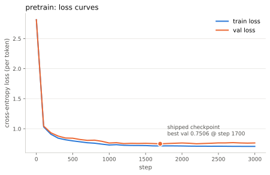
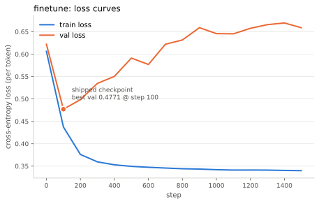

# Lab report: the loss curves

> **Spoiler warning.** This chapter is a worked solution of
> [exercise 6](08-exercises.md#6-plot-the-loss-curves--30-minutes).
> If you have not tried it yourself yet, go do that first — the exercise is
> the point, this report is the answer key.

`train.py` logs `train_loss` and `val_loss` to `runs/<stage>/log.csv`
every 100 steps, and the whole exercise is that one summary number —
"best val loss 0.4771" — hides a drama the curves make obvious in a
second. `minillm/plot_loss.py` (new, and deliberately dependent on a
`pip install matplotlib` that is *not* in `requirements.txt` — the core
pipeline stays torch+numpy+pytest) renders them:

```bash
uv pip install --python .venv/bin/python matplotlib
.venv/bin/python -m minillm.plot_loss        # runs/pretrain + runs/finetune
```

The SVGs are deterministic (fixed hash salt, no embedded date), so
re-running the script on the reference logs reproduces the committed
files byte for byte.

## Pretraining: the boring curve you want



Validation starts at 2.815 — essentially the 15-token clueless baseline
of ln 15 ≈ 2.708 plus a little initialization noise — and both curves
fall together to ~0.76, staying glued to each other for all 3,000 steps
(final gap: 0.707 train vs 0.764 val). With 1,179 training games and
11,996 trainable target tokens, the corpus is rich relative to what is
being asked of it, and nothing overfits. The shipped checkpoint (step
1700, val 0.7506) is barely better than the last one — here,
best-checkpoint selection is a formality.

## Finetuning: the textbook drama



Same code, different corpus, opposite story. Validation loss bottoms out
at **0.4771 at step 100** — the *first* evaluation after warmup — then
climbs monotonically back to 0.659 by step 1499 while train loss keeps
falling to 0.340. From step 100 onward, every additional step makes the
model *worse* at held-out games while making it *better* at the training
set: textbook overfitting, in one picture.

**Why is the shipped checkpoint still good?** Because the checkpoint on
disk is not the model the loop ended with. One line in
`minillm/train.py` saved the day:

```python
if val_loss < best_val:
    best_val = val_loss
    torch.save(model.checkpoint_dict(...), out_dir / "model.pt")
```

`model.pt` is only ever overwritten when validation improves, so the
1,500-step run quietly kept the step-100 model and threw the other 1,400
steps of specialization away. The size explanation from the exercise
hint makes the overfitting unavoidable rather than a bug: finetuning
sees just 301 expert games after the val split, and the SFT loss mask in
`build_tensors` throws away the opponent-move targets on top — 1,872
trainable target tokens in total, against ~0.8M parameters. A model that
large *will* memorize a corpus that small; the design answer is not "do
not overfit" but "evaluate on held-out data and keep the best
checkpoint". *Not checkpointing on val* would have been the bug.

One nuance worth saying out loud: per-token val loss and playing
strength are correlated but not the same thing. The step-100 checkpoint
is best at *predicting held-out expert games*, which is what we can
measure without playing; the eval table in
[07 — Evaluation](07-evaluation.md) is what justifies trusting that
proxy (the shipped checkpoint draws the perfect solver 61% of the time).
The [multi-seed rerun](09-char-tokenizer-lab.md#multi-seed-which-of-these-numbers-survive-a-reseed)
shows the residual wobble in that proxy: which best-val checkpoint you
land on is a lottery worth three seeds of insurance.

> **In a real LLM:** this plot is why every serious training run logs to
> a dashboard and why "checkpoint selection" is a stage of its own.
> Pretraining at web scale rarely overfits (the corpus outweighs the
> model), but finetuning stages — SFT on curated demonstrations, reward
> models on preference data — live exactly in this report's regime:
> small, precious datasets against enormous capacity. Early stopping,
> best-on-validation checkpointing, and LR schedules tuned to stop
> before the climb are the industrial versions of the one `if` statement
> above. And the gap between "best val loss" and "best behaviour" is why
> production selection increasingly runs *evals*, not just loss, over
> the checkpoint zoo.

## Reproduce it

```bash
make pretrain && make finetune       # regenerate the logs (seeded)
uv pip install --python .venv/bin/python matplotlib
.venv/bin/python -m minillm.plot_loss
git diff --stat docs/img/            # byte-identical SVGs
```

Next: [07 — Evaluation](07-evaluation.md) for what the shipped
checkpoints actually do, or back to the [exercises](08-exercises.md).
