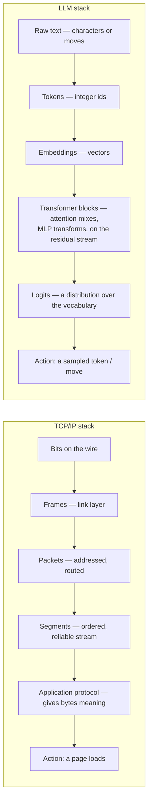

# Why this exists — understanding the LLM stack the way we understand TCP

Nobody thinks a loaded web page is magic. When you type an address and a page
appears, there is a stack of transformations underneath that moment, and an
engineer can point to every layer of it. Bits go out on a wire. A link layer
frames them. A network layer addresses them into packets and routes them
across machines that have never met. A transport layer turns an unreliable
stream of packets into an ordered, reliable connection. An application
protocol gives those bytes meaning — a request, a response, a document. At
the top, something concrete happens: a page renders, a message sends. None of
this requires faith. If a page fails to load, you can look at each layer in
turn — DNS, TCP handshake, TLS, HTTP status — and say which one broke. That
is what it means for a system to be *legible*: not that it is simple, but
that its complexity is organized into layers you can separately understand,
inspect, and debug.

I think large language models deserve, and increasingly require, the same
kind of literacy — and this repository is my attempt to make that literacy
buildable rather than merely asserted.

## The same shape

An LLM is also a stack of transformations, and it maps onto the networking
stack more precisely than the analogy first suggests. Raw text — characters,
words, in this repo whole game moves — becomes tokens: integer ids indexing
a fixed vocabulary. Tokens become embeddings: dense vectors in a space where
distance and direction start to carry meaning. Those vectors travel up a
*residual stream*, a shared bus that every layer reads from and writes back
onto. Each layer performs two kinds of work on that stream: attention lets
positions look at each other and mix information across the sequence; an MLP
then transforms each position's representation on its own. Stack enough of
these layers and the representation gets richer at every step, the same way
a byte stream gets more structured as it moves up the networking stack. At
the top, the representation is turned into logits — a score per vocabulary
entry — and one token is sampled. That sampled token is the action. In this
repo the action is a legal move in a small board game. In a frontier model
it is the next token of an answer, a line of code, a decision summary. Same
shape, different vocabulary, radically different scale.

Neither stack is magic. Both are legible once you have looked at every
layer once, slowly, with the ability to inspect what each one actually
computed.

## Infrastructure needs literate operators

Nobody expects every engineer to write a TCP stack from scratch, but every
engineer who touches a networked system carries a working model of what
"the network" is doing — enough to know that a timeout is not the same
failure as a refused connection, that DNS is a different layer than TLS,
that "it's slow" and "it's down" point a debugger in different directions.
That baseline literacy is what lets people *reason* about the system instead
of just poking it and hoping.

Language models are becoming infrastructure at the same pace TCP once did —
routing decisions, drafting documents, writing and reviewing code, sitting
in the loop of products used by people who will never read a research paper
about attention. As that happens, understanding the stack stops being a
research specialty and becomes basic literacy: for the engineers building on
top of it, for the decision-makers funding and regulating it, and for the
citizens whose lives it increasingly touches. The alternative to literacy is
not neutral — it is superstition. Treating a model as an oracle that must be
right because it sounds confident, or as a demon that must be lying because
it sometimes is, are both what happens when a system runs decisions through
people who cannot see any of its layers. Legibility is the cure for both.

## Why a frontier model cannot teach you this

The trouble is that you cannot build this literacy on a frontier model,
because a frontier model resists exactly the kind of inspection this
requires. Its parameters number in the hundreds of billions — nobody holds
that in their head, or even on their screen. Its training data is scraped
from the web, filtered by pipelines that are themselves proprietary, and no
one can enumerate "all of English" the way you can enumerate a small,
closed world. And most importantly: there is usually no ground truth to
check its output against. When a frontier model answers a question, deciding
whether the answer is *right* is itself hard — often as hard as the original
question. You are asked to trust a story about how the system works, because
verifying that story yourself is, in practice, out of reach.

This repository removes every one of those obstacles on purpose.

The model here is a real GPT — the same decoder-only Transformer family as
GPT-2/3, Llama, or Claude — shrunk to 797,312 parameters, rounded in the
docs to "~0.8M." You can read every tensor. The training corpus is not
scraped or filtered; it is *enumerated*: exactly 1,310 possible complete
games of Drop-Tac-Toe (Tic-Tac-Toe with Connect-Four gravity) across 694
reachable positions, small enough that the corpus is the entire population,
not a sample, and small enough that you can open the file and read every
game it ever saw. And the game is exactly solvable: a negamax solver proves
its game-theoretic value and hands back the correct move for any position.
That solver is the ground truth a frontier model never gives you. When this
repo's docs claim "pretraining teaches the rules, finetuning teaches how to
win," that is not a story to trust — it is a number you get by running
`make eval` and checking the model's moves against the solver yourself.

You are not asked to believe an account of how LLMs work. You are handed the
means to measure it.

## Faithful in shape, not exhaustive

The miniature is not a toy in the dismissive sense — every stage of a
production pipeline is genuinely present here: the same tokenize step, the
same two training stages in the same order (pretraining on the full
distribution, then finetuning that narrows behavior toward a goal, with the
opponent's — the "other side's" — moves masked out of the loss exactly the
way a chat SFT stage masks the user's turns), the same sampling machinery
(temperature, top-k, legality constraints standing in for guardrails), and
the same category of evaluation question: is it correct, is it good. It is
five to six orders of magnitude smaller than a frontier model, and that
is precisely what makes it inspectable rather than merely described.

It is also not exhaustive, and the docs are explicit about where it stops:
there is no mixture-of-experts router — one dense stack of layers handles
every input, there is nothing to route between. And there is no RLHF stage;
the pipeline ends at supervised finetuning, with a reinforcement-learning
self-play stage left as an exercise rather than something the code runs.
Naming these gaps matters more than papering over them — the value of this
repo is that every claim it makes is checkable, and a claim to completeness
that were not checkable would undermine that on the first page.

## Run it, read it, break it

The fastest way anyone has ever come to understand a system is to perturb
it and watch what changes — flip a flag, change one number, and see which
behavior moves and which stays put. That is how people actually learn what
a TCP timeout parameter does, and it is how you actually learn what an
attention head is tracking. At frontier scale that strategy is barely
available to anyone: a single training run costs more than most research
budgets, and "just try it" is not a sentence you get to say. At this scale
it is the whole method. Retrain with one layer removed. Cut the embedding
dimension in half. Swap the move-level tokenizer for the character-level one
built in the exercises and watch the sequence length triple. Every one of
those experiments finishes in minutes on a laptop CPU, against a ground
truth that will tell you, honestly, whether you helped or hurt.

Run it. Read the 1,310 games it learns from — all of them, it will not take
long. Then change one thing and watch what happens. That is the invitation
this whole repository is built to make good on.

Start with [00 — Overview](00-overview.md) for the map of the pipeline, and
keep the [glossary](glossary.md) open for when a term needs grounding in
running code.
