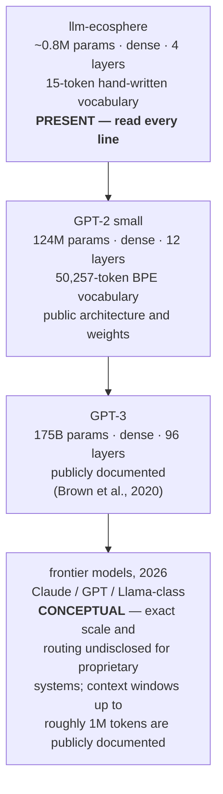
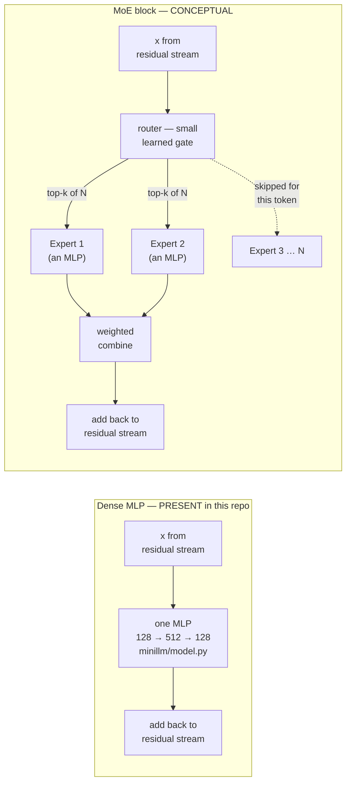

# Outlook — from this miniature to a frontier model

Every other chapter in this repo ends at a boundary you can touch: a
checkpoint file, a metric in `runs/eval.json`, a test that passes or fails.
This chapter is different. It steps past that boundary, toward the
frontier models — Claude, GPT, Llama-class systems — that share this repo's
architecture but not its scale, its openness, or, in places, its published
detail.

Because that boundary matters, this page marks it constantly. Two labels
recur throughout:

- **Present in this repo** — code you can open, a test you can run, a
  number you can reproduce with `make eval`.
- **Conceptual — beyond this repo** — real, citable research or industry
  practice that this codebase does not implement and, at this scale, mostly
  cannot.

Nothing below is invented. Every non-obvious claim carries a citation to a
paper, a blog post, or a primary source you can go read yourself — the same
principle [`motivation.md`](motivation.md) argues for the repo as a whole,
applied to the horizon past its edge. Where a topic is genuinely contested
in the field (emergence), or genuinely speculative (recursive
self-improvement), that is stated plainly rather than smoothed over. And
where a claim would require knowing the internal architecture of a specific
proprietary model — including Claude Opus or Claude's most capable
model — this page says so and stops, because that information is simply
not public.

## 1. What the big ones do that this miniature does not

Start with the reassuring half of the story: frontier LLMs did not invent a
new kind of machine. [`04-model.md`](04-model.md) already says it — this is
"the same decoder-only Transformer architecture as GPT-2/3, Llama or
Claude" — and [`10-gpu-cuda.md`](10-gpu-cuda.md) quantifies the gap as five
to six orders of magnitude of scale, not a change in shape. Tokens become
embeddings, embeddings travel up a residual stream, attention moves
information between positions, an MLP transforms each position on its own,
a final projection produces logits, and a token is sampled. That loop,
exactly as `minillm/model.py` implements it, is still what every frontier
model is doing at inference time.

What scale buys, on top of that identical loop, is a list of capabilities
this repo's 797,312 parameters and 15-token vocabulary have no room for:

| Capability | What it is | Connects back to |
| --- | --- | --- |
| Very long context | Attending over far more tokens than this repo's `block_size = 16`. Context windows in current publicly documented frontier systems reach up to roughly a million tokens — a scale-up of the same `q @ k.transpose(-2, -1)` attention in `CausalSelfAttention`, not a different mechanism. | The causal mask and softmax in [04 — The model](04-model.md); the `O(T²)` cost that motivates the KV cache in [exercise 5](08-exercises.md#5-implement-a-kv-cache-in-generate--a-weekend) |
| Multi-step reasoning | Chaining many next-token predictions — often including explicit intermediate steps — into a longer chain of inference before answering, rather than emitting the answer directly. Still the same autoregressive loop in `GPT.generate()`, run for more steps, over a vocabulary rich enough to contain "reasoning" as a kind of text. | `GPT.generate()`'s autoregressive loop (glossary: [Autoregressive model](glossary.md#autoregressive-model)) |
| Code | The vocabulary includes source code the way this repo's vocabulary includes `A1`..`C3` — tokens for a closed formal system. A frontier tokenizer's ~100k-token BPE vocabulary (versus this repo's 15 hand-written tokens) has to cover source code as a dialect of "text". | [03 — Tokenization](03-tokenization.md), and the "vocabulary design is destiny" framing there |
| Tool use | The model emits structured text (a function call, a query) that a harness outside the model executes, feeding a result back into the context before generation continues. Structurally close to this repo's legality-masked play loop in `play.py` — the model proposes, an external referee constrains — except the "tool" is arbitrary code, not `game.py`'s fixed rule set. | `play.py`'s constrained decoding loop; [06 — Inference](06-inference.md) |
| Multimodality | Extending the embedding step so images, audio, or other modalities are tokenized into the same residual stream as text, instead of only `wte`'s 15-row lookup table over move tokens. | `wte`/`wpe` in [04 — The model](04-model.md) — the same "trade a discrete symbol for a vector" trick, over a different alphabet |
| Agentic behavior | Running the autoregressive loop across many turns, tool calls, and — in current frontier systems — minutes to hours of wall-clock time, with the model's own prior outputs (and tool results) becoming part of its next input. An extended, self-referential version of `GPT.generate()`'s "append, repeat." | `GPT.generate()`; the whole `play.py` interaction loop, extended indefinitely and given the ability to act, not just move |

Two honesty notes belong here, because this is exactly the point where it
would be easy to overstate what is known.

> **Conceptual — beyond this repo:** the internal architecture of any
> specific current proprietary model — including Claude Opus or Claude's
> most capable model, Fable — is not public. Parameter counts, exact layer
> counts, whether or how a given model routes tokens through specialized
> subnetworks: none of that is disclosed for those systems, and this page
> does not guess at it. What follows describes the *general* frontier
> picture — architectural ideas that are public, in published papers or
> open-weight models — not the internals of any one named product.

> **Present in this repo, precisely because it is small:** every claim
> [`00-overview.md`](00-overview.md) makes about this repo — "pretraining
> teaches form, finetuning teaches intent" — is checkable by running
> `make eval` against an exact solver. Frontier-scale claims about
> capability rarely have that luxury; the rest of this page returns to that
> asymmetry more than once.

## 2. Mixture-of-Experts (MoE) and the router

**Conceptual — beyond this repo.** This repo's `MLP` class in
`minillm/model.py` is a single dense feed-forward network: every token that
reaches a block's MLP is processed by the *same* `128 → 512 → 128` pair of
matrices, no exceptions. [`motivation.md`](motivation.md) names this gap
explicitly: "there is no mixture-of-experts router — one dense stack of
layers handles every input, there is nothing to route between."

### What MoE is

A Mixture-of-Experts layer replaces that one dense MLP with several
parallel feed-forward networks — "experts" — plus a small learned *router*
(or gating network) that looks at each token and decides which one or two
experts should process it. Crucially, most experts sit idle for most
tokens: **only the selected experts run**, per token, per layer.

The canonical reference is the **Switch Transformer**
([Fedus, Zoph & Shazeer, 2021/2022](https://arxiv.org/abs/2101.03961)),
which simplified earlier MoE designs down to routing each token to exactly
one expert (`top-1`) and demonstrated stable training at trillion-parameter
scale while keeping the *compute per token* roughly constant. A widely used
open-weight example is **Mixtral 8x7B**
([Jiang et al., 2024](https://arxiv.org/abs/2401.04088)), whose paper
documents a concrete, publicly disclosed version of the idea: each of its
32 layers has 8 expert MLPs, a router selects 2 per token, and the model
holds roughly 47B total parameters while using only about 13B of them for
any given token.

### Why it exists

The whole point is to break a coupling that a dense model like this one
cannot avoid: in `minillm/model.py`, total parameter count and per-token
compute are the *same number* — every parameter is used on every forward
pass. MoE decouples them. A model can hold far more total knowledge (more
experts, more parameters) without paying for it on every single token,
because each token only activates a small subset of the network. This is
why the field talks about MoE models by two different numbers at once —
*total* parameters (what is stored) and *active* parameters (what is
computed per token) — a distinction that is meaningless for a dense model
like the one in this repo, where they are identical by construction.

### Where it would sit in this codebase

The router would replace exactly the `self.mlp(self.ln_2(x))` call in
`Block.forward` (`minillm/model.py`) — everything upstream (attention, the
residual stream, the causal mask) is architecture that MoE models keep
unchanged; only the per-position feed-forward step becomes conditional.

### Trade-offs

MoE is not free complexity-for-free. Two costs are well documented in the
literature above:

- **Routing balance.** If the router learns to favor a few experts, those
  experts become bottlenecks while others are undertrained — the Switch
  Transformer paper's stability tricks (an auxiliary load-balancing loss,
  careful initialization) exist specifically to fight this failure mode.
- **Memory.** All experts must be held in memory even though only a few run
  per token — Mixtral's 47B *total* parameters must be resident even though
  a given forward pass only computes with 13B of them. MoE trades compute
  for memory, not compute for nothing.

**This repo stays dense on purpose.** At 797,312 parameters there is no
capacity problem to solve — [08 — Exercises](08-exercises.md#3-ablations-what-is-actually-load-bearing--an-afternoon)
already shows the model is "deliberately overpowered" for a 15-token world.
Building a router here would add exactly the complexity this repo exists
to avoid, without a capacity problem to justify it.

## 3. Emergence and "self-improvement" — carefully

This section covers four distinct ideas that get casually blended in
popular writing about LLMs. They are not the same claim, they do not have
the same evidentiary status, and conflating them is exactly the kind of
imprecision the rest of this repo tries to avoid. Read them as four
separate rows, not a ladder.

### 3.1 Emergent capabilities with scale — a genuinely contested claim

**Conceptual — beyond this repo**, and not because of a capacity gap: this
repo's tiny, fully enumerable world has no analogue for "capability that
appears only past a scale threshold," because every capability this model
could plausibly have is either present at nearly any parameter count (the
task is a 15-token closed world) or absent regardless of scale.

The original framing comes from
[Wei et al., 2022, "Emergent Abilities of Large Language Models"](https://arxiv.org/abs/2206.07682):
an ability is called *emergent* if it is not present in smaller models but
appears in larger ones, in a way that a scaling-law extrapolation from the
smaller models would not have predicted — near-random performance up to
some model scale, then a sharp rise. The paper reports this pattern across
several benchmarks, including multi-step arithmetic and certain
few-shot-prompted tasks.

That framing is **actively disputed**. In
[Schaeffer, Miranda & Koyejo, 2023, "Are Emergent Abilities of Large Language Models a Mirage?"](https://arxiv.org/abs/2304.15004) (NeurIPS 2023),
the authors argue that many reported "emergent abilities" are an artifact
of the *metric* used to score them, not a fundamental change in what the
model is doing. A metric that is nonlinear or discontinuous in the model's
per-token error rate — for instance, "exact match on a multi-digit
arithmetic problem," which the model must get every digit right on to
score at all — can turn a smooth, continuous improvement in the underlying
error rate into what looks like a sudden jump. Switch to a continuous
metric (per-token accuracy rather than exact-match) on the same model
outputs, and the same task often shows smooth improvement instead. The
paper's secondary claim is that too few test examples at small scale can
also manufacture apparent sharpness.

Treat "emergence" as an open empirical question, not a settled fact in
either direction: some capabilities may genuinely require crossing a
capacity threshold that a naive scaling-law fit would miss; some apparent
thresholds are measurement artifacts of the kind Schaeffer et al. describe.
Both papers are worth reading before repeating either claim.

### 3.2 In-context learning — adapting with no weight update at all

**Conceptual — beyond this repo, in the specific sense that matters here.**
This repo's model does condition on a prompt — the move history so far,
exactly as `encode_prompt` in `minillm/tokenizer.py` builds it — but that
is not the same thing as in-context learning. Every task this model can
perform is a task it was trained on; there is no novel task, demonstrated
only within a single prompt, that the model has never seen anything like
during training. In-context learning is specifically the surprising case
where a model performs a *new* task, defined only by a handful of examples
placed in the prompt, with **no gradient step and no change to any
weight** — the parameters at the end of the prompt are bit-for-bit
identical to the parameters at the start of it.

This is the headline result of
[Brown et al., 2020, "Language Models are Few-Shot Learners"](https://arxiv.org/abs/2005.14165)
(the GPT-3 paper): a sufficiently large language model, given a handful of
input-output examples in its prompt, can often perform the underlying task
on a new input — translation, arithmetic, simple classification — competing
with models that were explicitly fine-tuned on that task, purely by
conditioning on the examples at inference time.

Why this surprised people: nothing in the training objective — plain
next-token prediction, exactly the cross-entropy loss `GPT.forward` in
`minillm/model.py` computes here — explicitly optimizes for "learn a new
task from a few examples." That capacity appears to *fall out of* scale on
a broad enough training distribution, rather than being trained for
directly. There is no equivalent phenomenon to point at in a model trained
on a single closed 15-token game; there is no space of "novel tasks" this
repo's world could contain one of.

### 3.3 Models improving models — the realistic sense of "self-development"

This is the one sense of "self-improvement" that is an established,
widely used industry practice today — as long as it is stated precisely:
**a model, or a human-authored process built around a model, generates
training signal that shapes the *next* model.** Not a model spontaneously
rewriting its own weights mid-conversation. A separate training run,
consuming data or feedback a model helped produce.

Concrete, citable instances:

- **RLAIF (Reinforcement Learning from AI Feedback).** Instead of humans
  ranking model outputs (RLHF), a separate AI model provides the preference
  labels. [Lee et al., 2023, "RLAIF: Scaling Reinforcement Learning from Human Feedback with AI Feedback"](https://arxiv.org/abs/2309.00267)
  reports that, across summarization and dialogue tasks, this AI-labeled
  approach achieves performance comparable to human-labeled RLHF.
- **Constitutional AI.** [Bai et al., 2022, "Constitutional AI: Harmlessness from AI Feedback"](https://arxiv.org/abs/2212.08073) —
  Anthropic's published method — trains a model to critique and revise its
  own outputs against a written set of principles (a "constitution"), then
  uses a further AI-feedback stage in place of human harmlessness labels
  for reinforcement learning. The model's own generations, evaluated
  against explicit written rules, become the training signal for a later
  version of itself.
- **Distillation and synthetic data**, more broadly: training a smaller or
  later model on outputs generated by a larger or earlier one, rather than
  (or in addition to) raw human-authored text.

> **Present in this repo, as the closest available analogue.** Finetuning
> here (`minillm/train.py --stage finetune`) trains on
> `data/expert_games.jsonl` — 334 games generated by `minillm/solver.py`'s
> exact negamax search, with the opponent's moves masked from the loss.
> That is a model (well — a hand-coded oracle, not a neural network)
> generating the training signal a later stage learns from, which is the
> same *shape* as distillation from a stronger teacher into a weaker
> student. The load-bearing difference: `solver.py` is a provably correct,
> deterministic search, not another trained model with its own errors and
> biases to propagate — RLAIF and Constitutional AI both feed a *learned,
> imperfect* judge's opinions forward into the next model, which is a much
> less certain source of signal than a negamax solver's proven-optimal
> move.

### 3.4 Recursive self-improvement — speculative, not a capability

**Clearly speculative — an AI-safety discussion topic, not something any
current model does.** This is the idea that a sufficiently capable
system could improve its *own* design — not just be retrained by a
separate process, but actively drive the improvement of its successor,
faster and more effectively than its human designers could, in a
feedback loop that compounds.

The concept traces to
[I. J. Good, 1965, "Speculations Concerning the First Ultraintelligent Machine"](https://www.semanticscholar.org/paper/Speculations-Concerning-the-First-Ultraintelligent-Good/d7d9d643a378b6fd69fff63d113f4eae1983adc8)
(*Advances in Computers*, vol. 6, pp. 31–88), which coined the term "intelligence
explosion": Good — a statistician who had worked with Alan Turing on
wartime codebreaking — argued that since designing better machines is
itself an intellectual activity, a machine that surpassed humans at every
intellectual activity would, by that same argument, surpass humans at
machine design, and could design a successor better than itself, which
could design a better successor still.

Treat this as exactly what it is: a sixty-year-old thought experiment that
remains a live topic in AI-safety research and debate, not a documented
capability of any existing system, and not something this repo — or any
current publicly known model — does or attempts. Distinguishing it sharply
from §3.3's models-improving-models (which is real, documented, and
running in production pipelines today) is the entire point of splitting
these into separate subsections.

## 4. How you investigate what a model learned (interpretability)

Everything above described capabilities. This section is about a
different question: once a model can do something, how do you find out
*how*, by looking inside the weights rather than just watching the
outputs? That field is called **mechanistic interpretability** — reverse-
engineering the computation a trained network implements, the way you
might reverse-engineer a compiled binary.

**Present in this repo, at the coarsest level.**
`minillm/inspect_attention.py` already does the simplest form of this: it
runs a forward pass with `record_attn=True` and prints the literal
post-softmax attention weights per layer, per head. [04 — The
model](04-model.md) shows this catching a real, unprogrammed finding —
layer 1, head 1 puts 0.80 of its attention mass from `B2` back onto `B1`,
the earlier move in the same column, evidence that the head learned to
track column stack heights because the gravity rule requires it. That is
already interpretability, not a metaphor for it. The tools below go
further than raw attention weights, into the residual stream and the
weights themselves.

### Logit Lens

Every block's output is a vector in the same 128-dimensional residual
stream that the final layer eventually projects to logits via
`self.lm_head`. The **logit lens**, introduced by
[nostalgebraist, 2020, "interpreting GPT: the logit lens"](https://www.lesswrong.com/posts/AcKRB8wDpdaN6v6ru/interpreting-gpt-the-logit-lens),
applies that *same* final unembedding projection to the residual stream at
every intermediate layer, not just the last one — effectively asking "if
the model had to guess the next token right now, using its actual output
head, what would it say?" at each layer in turn. The original post found
that GPT's intermediate guesses evolve in a legible progression: early
layers are close to uninterpretable, middle layers produce a "shallow"
guess (plausible part of speech, register), and later layers refine that
guess toward the final answer.

### Tuned Lens

The logit lens reuses the model's *own* unembedding matrix at every layer,
which the original post itself flagged as sometimes brittle — a layer's
representation is not guaranteed to be "in the same basis" the final layer
expects. [Belrose et al., 2023, "Eliciting Latent Predictions from Transformers with the Tuned Lens"](https://arxiv.org/abs/2303.08112)
fixes this by training a small learned affine probe *per layer*, on a
frozen pretrained model, that translates each layer's residual-stream
vector into the same space the final unembedding expects — a calibrated
version of the same idea. The paper reports the tuned lens is more
predictive and less biased than the raw logit lens, tested on
autoregressive models up to 20B parameters.

### Jacobian-based sensitivity analysis

This is a general mathematical tool, not a single named method with one
canonical paper the way the two lenses above are — worth being precise
about that distinction rather than dressing it up as more unified than it
is. The **Jacobian** of a network's output with respect to its input (or of
one internal activation with respect to an earlier one) measures how much
a small change at the source shifts the result at the target — literally
the matrix of partial derivatives, computable via the same automatic
differentiation machinery that trains any neural network, `GPT.forward` in
this repo included.

The oldest well-known instance in deep learning is the *saliency map*:
[Simonyan, Vedaldi & Zisserman, 2013, "Deep Inside Convolutional Networks: Visualising Image Classification Models and Saliency Maps"](https://arxiv.org/abs/1312.6034)
computed the gradient — one row of a Jacobian — of a class score with
respect to an input image's pixels, to visualize which pixels the model's
decision was most sensitive to. The same idea, applied between two internal
activations instead of input and output, gives a general handle on "how
strongly does this part of the network influence that part" — a building
block that more specific, named attribution methods (Integrated Gradients
and others) build on and refine, each adding assumptions the raw Jacobian
alone does not make.

*This section deliberately stays at the level of the general technique.
A specific named Jacobian-based interpretability method aimed at this
repo's model — one that connects a query position's output sensitivity
back to particular earlier tokens or attention heads — is a natural
follow-up and a reasonable exercise to add to [08 — Exercises](08-exercises.md)
once scoped, but no such method is asserted here.*

### Briefly: three more tools in the landscape

- **Activation patching / causal tracing.** Run the model twice — once on
  an input that produces the correct output, once on a corrupted variant
  that doesn't — then copy individual internal activations from the clean
  run into the corrupted run and see whether the correct output comes
  back. If it does, that activation was causally load-bearing for the
  behavior. [Meng, Bau, Andonian & Belinkov, 2022, "Locating and Editing Factual Associations in GPT"](https://arxiv.org/abs/2202.05262)
  (the ROME paper, NeurIPS 2022) is the widely cited instance of this
  technique, using it to localize where GPT-2-class models store specific
  factual associations, in a small number of middle-layer MLP modules.
- **Probing classifiers.** Freeze a trained model, train a small separate
  classifier on top of its internal activations to predict some property
  of interest (part of speech, syntax tree depth, sentiment), and use the
  probe's accuracy as evidence for whether that property is linearly
  recoverable from the representation. Introduced by
  [Alain & Bengio, 2016, "Understanding Intermediate Layers Using Linear Classifier Probes"](https://arxiv.org/abs/1610.01644);
  [Belinkov, 2022, "Probing Classifiers: Promises, Shortcomings, and Advances"](https://direct.mit.edu/coli/article/48/1/207/107571)
  (Computational Linguistics 48(1)) surveys the method's real limitations —
  a probe finding a property is recoverable does not prove the model
  *uses* that property in its actual computation.
- **Sparse-autoencoder "features."** Individual neurons in a Transformer
  are frequently *polysemantic* — one neuron responding to several
  unrelated concepts, because the model is packing more concepts than it
  has neurons into a shared space. Anthropic's
  [Bricken et al., 2023, "Towards Monosemanticity: Decomposing Language Models With Dictionary Learning"](https://transformer-circuits.pub/2023/monosemantic-features)
  trains a sparse autoencoder — an over-complete, sparsity-penalized
  reconstruction of a layer's activations — to decompose that shared space
  into a much larger set of more individually interpretable directions
  ("features"). A year later,
  [Templeton et al., 2024, "Scaling Monosemanticity"](https://transformer-circuits.pub/2024/scaling-monosemanticity/)
  applied the same method to a production-scale model, Claude 3 Sonnet,
  and reported extracting millions of features — public, published
  interpretability research about a real Claude model, distinct from any
  claim about that model's undisclosed internal architecture.

### The payoff: why this miniature is an honest interpretability sandbox

Every tool above shares the same structural problem at frontier scale:
there is usually no independent ground truth to check the interpretation
against. A logit lens trace, a patched activation, a sparse-autoencoder
feature — each is a *hypothesis* about what a huge, opaque model is doing,
checked against other indirect evidence, because nobody can independently
verify "the correct answer" for an open-ended frontier-scale task the way
[`motivation.md`](motivation.md) says a solver can for this repo's game.

This repo does not have that problem. It is small enough to apply every
technique in this section cheaply — a logit lens over 4 layers and a
15-token vocabulary is a few lines of code, not a research infrastructure
project — **and** it sits next to `minillm/solver.py`, an exact, proven
oracle for the one thing the model is trying to do: play this game well.
That means a claim like "layer 1, head 1 tracks column stack height"
(already demonstrated in [04 — The model](04-model.md)) is not the end of
the investigation, the way it usually would be — it is a hypothesis you can
go on to check, position by position, against a game-theoretically correct
move the solver hands you for free. Building a logit lens or a small probe
against this model and grading its intermediate guesses against
`solver.py`'s verdicts, rather than against another model's opinion, is
interpretability research with a scoreboard that frontier scale essentially
never offers. That is the honest version of this repo's closing pitch:
not that it teaches you what a frontier model's 34 million sparse-autoencoder
features mean, but that it is small enough to let you check your own
interpretability tools against ground truth before you ever trust them on
a model that has none.

## Where to go next

This page is the horizon, not a destination — everything in it is either
"read the cited paper" or "come back and build it here first." Two
concrete next steps already exist in this repo:

- **Mixture-of-Experts, as a build exercise.** §2 above sketches exactly
  where a router would replace the dense `MLP` in `minillm/model.py`.
  Building a tiny 2-or-4-expert version of it against this repo's
  15-token vocabulary — and checking whether it changes anything measurable
  in `make eval` at this scale — is a natural, currently-missing addition
  to [08 — Exercises](08-exercises.md).
- **An RL stage, for §3's self-improvement material.**
  [Exercise 10](08-exercises.md#10-an-rl-stage-reinforce-self-play-after-sft--a-weekend)
  already sketches a REINFORCE self-play loop on top of the finetuned
  checkpoint — the closest this repo comes to the training-signal-from-a-model
  idea in §3.3, minus the "AI feedback" (the reward is the exact game
  engine, not a learned judge).

From here:

- Back to [00 — Overview](00-overview.md) for the map of what this repo
  actually runs.
- The [glossary](glossary.md) grounds every term this page used — token,
  attention, residual stream, RLHF — in this repo's running code.
- [08 — Exercises](08-exercises.md) is where "conceptual" turns back into
  "present in this repo," one modification at a time.
