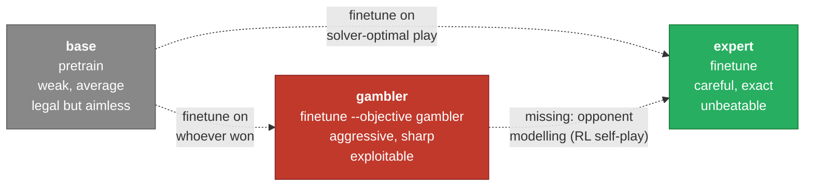

# The models in detail — base, expert, and gambler

This repo trains one architecture — the ~0.8M-parameter GPT in
[`minillm/model.py`](https://github.com/yves-vogl/llm-ecosphere/blob/main/minillm/model.py)
— three times, over the same data, with three different training
recipes. Nothing about the network changes between them: same layers,
same vocabulary, same optimizer. What changes is *what they are asked to
imitate*, and that alone is enough to produce three players with
distinct, measurable personalities. This page is the character study:
what each one trains on, how it plays, the numbers behind that, how to
build it yourself, and how to test it.

Read this after [05 — Training](05-training.md) (the mechanics of
pretraining and finetuning) and [07 — Evaluation](07-evaluation.md) (what
each metric below means). If a term here is unfamiliar, the
[glossary](glossary.md) grounds it in code.

## The spectrum

Line the three up by one question: *how does this model behave against
an opponent who never makes a mistake?* That single axis — not "win rate
vs random," which is a different, sometimes contradictory story — is
what separates them:



Base sits at the weak end because it never optimizes for winning at all
— it only imitates the *average* game. Expert sits at the strong end
because it imitates a perfect player and inherits the guarantee that
comes with that: against a perfect opponent, the worst it can do is
draw. Gambler is the interesting middle case, and the one this page
spends the most words on: it is *more aggressive* than base but, despite
that aggression, **not** a dominant winner, and it is decisively
*more* exploitable than expert. Getting from "aggressive" to "aggressive
*and* unbeatable" is not a bigger finetuning dataset — it is a different
training stage entirely (RL self-play, exercise 10 below).

## Base — the rule-learner

**Trains on:** `data/all_games.jsonl`, all 1,310 possible complete
games, no curation. **Objective:** plain next-token prediction
(pretraining) — every move by both sides is a training target, with no
notion of who is "right." See
[`minillm/train.py`](https://github.com/yves-vogl/llm-ecosphere/blob/main/minillm/train.py)'s
`--stage pretrain` and [05 — Training](05-training.md).

**Character.** Base learns the *grammar* of Drop-Tac-Toe — legal drops,
gravity, turn order, when a game ends and who won — from nothing but
move sequences, the same way a real LLM learns grammar from raw text
before it learns to be useful. It plays legally almost all of the time.
It does not try to win: it imitates the *average* game in the
enumeration, which includes plenty of games where both sides play
carelessly. Against a random opponent it is barely better than a coin
flip. Against a perfect opponent it has no chance at all.

**Measured numbers** (move-level tokenizer):

| metric | value |
|---|---:|
| vs random, win / draw / loss | 41.8 / 20.3 / 38.0% |
| vs perfect solver, win / draw / loss | 0 / 0 / 100% |
| free-running clean self-play | 98.0% |
| chooses a solver-optimal move | 70.3% |

Losing 100% of the time against the solver is not a bug — it is the
expected signature of a model that never learned *intent*, only *form*.
70.3% solver-optimal is still meaningfully above chance among the legal
options, which tells you pretraining does absorb some tactical
regularity just from seeing every game once, but 100% losses vs perfect
play means that residual skill is nowhere close to enough.

**Build it:**

```bash
make pretrain
# equivalent:
.venv/bin/python -m minillm.train --stage pretrain
```

Writes `runs/pretrain/model.pt` (best-validation-loss checkpoint).

**Play or test it:**

```bash
python -m minillm.arena --model runs/pretrain/model.pt --vs solver
python -m minillm.arena --model runs/pretrain/model.pt --vs human
```

## Expert — the unbeatable one

**Trains on:** `data/expert_games.jsonl`, 334 games in which the solver
(negamax, exact) plays one side, with the loss masked so only the
solver's moves are training targets — the opponent's moves are seen as
context but never imitated. **Objective:** SFT, `--objective expert`
(the default). See `minillm/dataset.py`'s `expert_only` path and
[05 — Training](05-training.md#finetuning--sft) for the masking
mechanics.

**Character.** Expert is finetuned to imitate minimax-optimal play,
move by move. It is not merely "good" — it inherits the solver's core
guarantee that with perfect play Drop-Tac-Toe is a draw, so the ceiling
against a perfect opponent is a draw, never a loss, and 39% is the price
of a model that only *approximates* the solver rather than running it.
Against weaker opponents it converts that carefulness into wins more
often than either other model. It is the "safe" pick: pick this to
almost never lose, at the cost of leaving some wins against weak players
on the table that a more reckless policy would take.

**Measured numbers** (move-level tokenizer):

| metric | value |
|---|---:|
| vs random, win / draw / loss | 79.3 / 14.5 / 6.3% |
| vs perfect solver, win / draw / loss | 0 / 61 / 39% |
| free-running clean self-play | 90.5% |
| chooses a solver-optimal move | 86.5% |

**Build it:**

```bash
make finetune
# equivalent:
.venv/bin/python -m minillm.train --stage finetune --init-from runs/pretrain/model.pt
```

Writes `runs/finetune/model.pt`. `minillm.arena` and `minillm.play`
default to this checkpoint when `--model`/`--ckpt` is omitted.

**Play or test it:**

```bash
python -m minillm.arena --model runs/finetune/model.pt --vs solver
python -m minillm.arena --model runs/finetune/model.pt --vs human
```

## Gambler — the aggressive, exploitable one

**Trains on:** decisive games from the *full* enumeration
(`data/all_games.jsonl`, draws dropped), with the loss masked so only
the **winning** side's moves are training targets — the losing side's
moves are context, never imitated. **Objective:** SFT,
`--objective gambler`. See `minillm/dataset.py`'s `to_gambler_games` and
`winner_only` path, and `minillm/train.py`'s module docstring, which
calls this "aggressive lines that are exploitable by strong play, the
opposite of expert" in as many words.

**Character, and the honest finding.** Gambler is where the "training
choice changes the player" story gets sharp. It imitates whoever *won*
each decisive game in the exhaustive enumeration — not whoever played
best, whoever *won*. Those are different populations: a decisive game in
the full enumeration can be won because one side played sharply, but
just as easily because the *loser* blundered into a trap while playing
weak, meandering moves. Imitating the winner's moves in both cases
teaches "how games get won, including via weak defence" — a mix of real
tactical patterns and moves that only look good against a bad opponent.
The result is a model that is more willing to create winning chances
than base, but that inherited no filter for whether those chances hold
up against a defender who does not cooperate.

The numbers say exactly this, and they say it in two different
directions at once:

- **Against the perfect solver, gambler loses 70% of the time** — more
  than double expert's 39% loss rate. This is the point of the model's
  name: it takes lines a careful opponent punishes, and a perfect
  opponent punishes every one of them.
- **Against a random player, gambler is *not* a dominant winner** — 63.0%
  wins, clearly behind expert's 79.3%. If "aggressive" meant "reliably
  crushes weak play," this number would be higher than expert's, not
  lower. It isn't, because gambler's aggression was never validated
  against an opponent model — it was distilled from outcomes, and a
  fair share of those outcomes were decided by the loser's mistakes
  rather than the winner's brilliance. Some of what it imitates is
  simply not that good.

Put together: gambler is aggressive *and* beatable, at the same time,
against different opponents. That combination — a genuinely dominant
player who also sets traps a weaker opponent walks into — is not what
imitation learning over a fixed corpus produces, no matter which slice
of the corpus you imitate. It requires the model to react to what the
*opponent* actually does, which means practicing against an opponent
during training rather than a curated transcript after the fact. That is
reinforcement learning, specifically the self-play stage this repo
deliberately stops short of — sketched as exercise 10 in
[08 — Exercises](08-exercises.md#10-an-rl-stage-reinforce-self-play-after-sft-a-weekend).
An RL loop that rewards outcomes against an improving opponent, rather
than imitating a fixed set of winning transcripts, is the missing piece
between "aggressive" and "aggressive and dominant."

**Measured numbers** (move-level tokenizer):

| metric | value |
|---|---:|
| vs random, win / draw / loss | 63.0 / 15.5 / 21.5% |
| vs perfect solver, win / draw / loss | 0 / 30 / 70% |
| free-running clean self-play | 97.5% |
| chooses a solver-optimal move | 78.3% |

**Build it:**

```bash
make model-gambler
# equivalent:
.venv/bin/python -m minillm.train --stage finetune --objective gambler \
    --init-from runs/pretrain/model.pt --out-dir runs/exp-gambler-move
```

Writes `runs/exp-gambler-move/model.pt`.

**Play or test it:**

```bash
python -m minillm.arena --model runs/exp-gambler-move/model.pt --vs solver
python -m minillm.arena --model runs/exp-gambler-move/model.pt --vs runs/finetune/model.pt
```

The second command is the most direct way to see the trade-off:
gambler vs expert, checkpoint against checkpoint, no random or solver
opponent standing in.

## Move-tokenizer trio, side by side

All three checkpoints below use the 15-token move-level vocabulary
(one token per whole move, e.g. `B2`) and share the same architecture,
data split, and evaluation protocol —
[`minillm/evaluate.py`](https://github.com/yves-vogl/llm-ecosphere/blob/main/minillm/evaluate.py),
`python -m minillm.evaluate`. Reproduce any row with `--ckpt` pointed at
that model's checkpoint.

| metric | base (pretrain) | expert (finetune) | gambler (finetune --objective gambler) |
|---|---:|---:|---:|
| trains on | all 1,310 games | 334 solver-optimal games | decisive games, winner only |
| loss masking | none | opponent moves masked | losing side's moves masked |
| vs random, W/D/L | 41.8 / 20.3 / 38.0% | **79.3** / 14.5 / 6.3% | 63.0 / 15.5 / 21.5% |
| vs perfect solver, W/D/L | 0 / 0 / 100% | 0 / **61** / 39% | 0 / 30 / **70%** |
| clean free-running self-play | 98.0% | 90.5% | 97.5% |
| solver-optimal move rate | 70.3% | **86.5%** | 78.3% |

Read the middle two rows together, not separately: expert's 39% loss
rate against the solver and gambler's 70% are the whole story of
"careful" vs "exploitable" in one comparison. Read the top numeric row
against that: gambler's 63.0% vs random sits *between* base's 41.8% and
expert's 79.3%, not above expert's — aggression bought it more wins than
doing nothing, but not more wins than genuine care.

## The char-tokenizer variants

Everything above uses the move-level tokenizer. Swapping in the
13-token character-level tokenizer — `B2` becomes the two tokens `B`,
`2` — retrains base and expert with no other changes, and the result is
a genuinely different pair of models, not a rounding error:

| metric | move pretrain | char pretrain | move finetune | char finetune |
|---|---:|---:|---:|---:|
| vs random W/D/L | 41.8/20.2/38.0% | 41.2/21.5/37.2% | 79.2/14.5/6.2% | 68.8/22.2/9.0% |
| vs optimal solver W/D/L | 0/0/100% | 0/36/64% | 0/61/39% | 0/**95**/5% |
| optimal-move rate | 70.3% | 72.9% | 86.5% | 83.1% |
| clean self-play games | 98.0% | 99.0% | 90.5% | 98.0% |

The char-level expert model trades win rate against random (68.8% vs
79.2%) for a striking jump in draw rate against the solver (95% vs
61%) — the same sharp-vs-solid trade-off gambler vs expert shows above,
but produced by a tokenizer change instead of an objective change. The
full walkthrough — why splitting `B2` into two characters helps
legality instead of hurting it, and why the vs-solver gap is the one
result in that table you can trust at face value — is
[09 — Lab report: the character-level tokenizer](09-char-tokenizer-lab.md).

**A char-level gambler does not exist yet.** Nothing prevents training
one — `python -m minillm.train --stage finetune --objective gambler
--tokenizer char --init-from <a char pretrain checkpoint>` is a valid
command today — but no one has run it, so this page will not put numbers
next to it. It belongs on the same list as the RL self-play stage above:
a natural next experiment, not a result. If you train it, `make test`
and this page's move-level table are the pattern to follow when
reporting it honestly.

## See also

- [09 — Lab report: the character-level tokenizer](09-char-tokenizer-lab.md)
  — the char-tokenizer pair in full, including the regression discipline
  that makes the table above trustworthy.
- [`minillm/arena.py`](https://github.com/yves-vogl/llm-ecosphere/blob/main/minillm/arena.py),
  reachable as `python -m minillm.arena` — the one command that plays,
  benchmarks, or pits any two checkpoints against each other with the
  same move picker used everywhere else in this repo.
- [glossary](glossary.md) — look up **finetuning / SFT**, **loss
  masking**, and **RLHF** for the vocabulary this page leans on.
